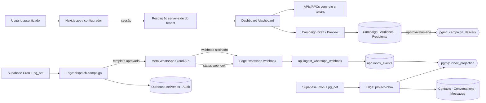

# Arquitetura incremental — Dashboard multiempresa, Inbox e campanhas

**Artefato:** arquitetura técnica e plano incremental  
**Base:** `escopo-dashboard-multiempresa.md`, `requisitos-inbox-campanhas-piloto.md` e `modelo-dominio-crm-campanhas.md`  
**Estado:** documentado. Não implementado, não conectado em produção e não liberado para campanha real.

> **Princípio de produto:** `/dashboard` é uma área operacional do **tenant autenticado**. Não existe rota, variável, fallback, imagem ou consulta com semântica de “Dashboard William”. William permanece apenas como dado do primeiro tenant piloto.

## 1. Decisões arquiteturais

| Decisão | Escolha | Motivo e limite |
|---|---|---|
| Contexto de empresa | Resolvido no servidor a partir da sessão e membership ativa; nunca enviado como fonte de autorização pelo browser. | Evita que trocar `tenant_id` no front-end exponha dados de outra empresa. |
| Rota principal | Configurador permanece em `/`; acesso explícito para `/dashboard`; após reset/login retorna ao configurador. | Preserva o fluxo aprovado **B** e evita uma tela diária genérica sem contexto de negócio. |
| Inbox | `whatsapp-webhook` validado → `app.inbox_events` → fila durável → projeção de conversas/mensagens. | O webhook fica rápido e idempotente; o processamento de CRM não torna a confirmação da Meta dependente de UI. |
| Fila | Supabase Queues/`pgmq`, com worker Edge controlado por cron do Supabase. | A fila é durável e usa janela de visibilidade; o cron pode invocar Edge Functions com segredo armazenado no Vault.[1] [2] [3] |
| Campanha | Rascunho → audiência congelada → aprovação humana → fila de entregas → worker limitado → status via webhook. | Impede mutação de público depois da aprovação e torna retentativa segura. |
| Meta | Tokens e App Secret exclusivamente em segredos/Vault; chamadas Graph somente pelo worker Edge. | Nada de token na UI, banco de dados ou logs. |
| Agenda e CRM | `appointments.crm_contact_id` opcional, sem remover `customer_label`/`external_contact_ref`. | Migração compatível; nenhum agendamento histórico é perdido. |

## 2. Componentes e fronteiras

## 3. Fluxos operacionais

### 3.1 Resolução de tenant e navegação

O configurador continua como destino depois de autenticação e recuperação de senha. O layout autenticado recebe do servidor a membership ativa; se houver uma única empresa ativa, ela é selecionada. Quando houver mais de uma, o usuário escolhe uma empresa e essa escolha é persistida como preferência de sessão, não como permissão.

O botão **Operação** conduz a `/dashboard`. A rota executa a mesma resolução e consulta somente dados do tenant escolhido/permitido. A UI usa o nome, logotipo e unidade desse tenant; no estado inicial sem dados, mostra estados vazios neutros — nunca conteúdo do William.

| Caso | Comportamento exigido |
|---|---|
| Usuário sem membership | Redireciona ao onboarding/autorização; não cria tenant por efeito colateral. |
| Uma membership ativa | Abre configurador e dashboard do tenant automaticamente. |
| Várias memberships | Seletor explícito; troca revalida toda a query no servidor. |
| ID de outro tenant no URL/payload | Ignorado para autorização e registrado como tentativa inválida quando aplicável. |

### 3.2 Ingestão e projeção de inbox

O endpoint existente `supabase/functions/whatsapp-webhook` já limita payload, valida `x-hub-signature-256`, resolve WABA/número e chama `api.ingest_whatsapp_webhook`. Ele deve continuar apenas como ingresso confiável e resposta rápida à Meta.

Após persistir um evento novo, a função SQL de ingestão publica uma mensagem mínima na fila `inbox_projection`: `{ tenant_id, inbox_event_id, correlation_id }`. O worker `project-inbox` busca lote limitado, resolve conexão e canal do contato, cria/atualiza a conversa e materializa a mensagem. A mensagem de fila só é removida depois da transação terminar; erro recuperável prolonga a visibilidade e erro não recuperável é arquivado para investigação.

Os eventos de status de entrega/leitura/falha atualizam a mensagem ou `outbound_deliveries` pelo `provider_message_id`, em vez de criarem nova conversa. A Meta orienta que mensagens e seus status sejam recebidos por webhooks; portanto, a UI não pode inferir entrega pelo resultado síncrono de um POST.[4]

### 3.3 Campanha com envio real governado

O operador seleciona tenant, conexão WhatsApp, template sincronizado e regra de audiência. A API calcula a audiência usando apenas `marketing_consents.status = ACTIVE`, aplica descadastro, bloqueios, limite de frequência, disponibilidade de canal e política de campanha. A UI exibe elegíveis, excluídos e motivo de exclusão.

Ao aprovar, o sistema congela a audiência, grava `approved_by`, `approved_at`, hash do conteúdo/template e cria itens idempotentes de entrega. Uma função segura enfileira os destinatários aprovados. O worker `dispatch-campaign` reivindica um lote pequeno, verifica novamente consentimento e estado antes de cada chamada Graph API e persiste `provider_message_id`; a atualização posterior vem pelo webhook.

> **Proibição de segurança:** criar campanha, pré-visualizar ou aprovar não envia mensagem. O único componente autorizado a enviar é `dispatch-campaign`, sob identidade de serviço, depois de todas as guardas passarem.

## 4. Worker e agendamento

| Trabalho | Gatilho | Limite | Idempotência | Observabilidade |
|---|---|---|---|---|
| `project-inbox` | Cron periódico do Supabase invoca Edge Function por `pg_net`. | Lotes pequenos; sem timer residente. | `inbox_event_id` e `provider_message_id`. | Contagens processadas/falhas, `correlation_id`, fila atrasada. |
| `sync-whatsapp-templates` | Manual no piloto; cron só após validação. | Uma conexão por execução. | `(tenant_id, connection_id, provider_template_id, version)`. | Última sincronização e diferenças de status. |
| `dispatch-campaign` | Cron somente quando há campanha `QUEUED`; também pode ser acionado manualmente por aprovação. | Taxa máxima por conexão; lote curto; parada ao detectar erro de conta/template. | `campaign_recipient_id` + chave de idempotência. | Entregas por estado, exclusões pós-aprovação, erros por código Meta. |
| `expire-campaign-approvals` | Cron diário. | Campanhas ainda não enviadas. | Transição condicional de estado. | Auditoria de expiração/cancelamento. |

Não será usado `setInterval`, `node-cron` em processo Node ou timer do navegador: instâncias serverless não garantem continuidade. O Supabase suporta jobs recorrentes via `pg_cron`, que podem executar SQL ou invocar Edge Functions por HTTP com `pg_net`; os segredos da chamada devem ficar no Vault.[1] [2]

### Configuração segura do cron

O cron chama Edge Functions através de URL e chave recuperadas do Supabase Vault, nunca por segredo literal em migração. A documentação oficial exemplifica exatamente a combinação `pg_cron` + `pg_net` e recomenda Vault para o token de chamada.[1] Cada job terá nome estável, função de lock para impedir concorrência e log de execução. A plataforma recomenda não exceder oito jobs simultâneos e manter cada execução abaixo de dez minutos; por isso cada worker processa lotes pequenos.[2]

## 5. Contratos internos

| Contrato | Entrada permitida | Saída | Guardas obrigatórias |
|---|---|---|---|
| `api.resolve_dashboard_context()` | Sessão autenticada. | `tenant_id`, membership, unidade e permissões mínimas. | Sessão + membership ativa; sem `tenant_id` confiado ao cliente. |
| `api.project_inbox_event(p_event_id)` | Worker de serviço. | Conversa/mensagem projetada. | Evento pertence à conexão correta; UPSERT idempotente. |
| `api.preview_campaign(p_draft_id)` | OWNER/ADMIN do tenant. | Audiência congelável, contagens e exclusões. | Consentimento ativo, template válido, limites e tenant. |
| `api.approve_campaign(p_campaign_id)` | OWNER/ADMIN distinto do criador quando a política exigir. | Estado `APPROVED` e audit log. | Prévia recente, público imutável, nenhum envio direto. |
| `api.claim_campaign_batch()` | Worker de serviço. | Lote de destinatários elegíveis. | Lock/visibility, limite por conexão e verificação de estado. |
| `api.record_delivery_result()` | Worker ou webhook de serviço. | Estado de entrega. | Provider ID único e transição de estado permitida. |

## 6. Alternativas consideradas

| Alternativa | Decisão | Razão |
|---|---|---|
| Processar CRM e envio dentro do webhook | Rejeitada. | Aumenta tempo de resposta, acopla a Meta ao banco de CRM e torna retentativas perigosas. |
| Banco como polling sem fila | Rejeitada. | Não define visibilidade/claim de trabalho nem garante trabalho único em concorrência. |
| Timer em Vercel/Node | Rejeitada. | Não é persistente sob autoscaling e torna jobs difíceis de auditar. |
| Função Edge + Supabase Queue + Cron | Aprovada. | Separa ingresso, persistência, execução e retries; filas Supabase são duráveis e controlam visibilidade de mensagens.[3] |
| Disparo diretamente na UI | Rejeitada. | Expõe a integração a duplicidade e permite contornar aprovação/auditoria. |

## 7. Plano de implementação

| Ordem | Fatia | Entrega verificável | Não entrega |
|---|---|---|---|
| I1 | Contexto multiempresa do dashboard | Resolver tenant no servidor; remover toda referência fixa de William; entrada Configurador → Operação. | CRM/campanha ainda sem dados reais. |
| I2 | Modelo e RLS | Migração de contatos/canais/conversas/mensagens; políticas negativas cross-tenant. | Nenhuma campanha nem envio. |
| I3 | Inbox projetada | Fila, worker, UI de conversa por tenant e replay idempotente. | Resposta automática/IA não entra. |
| I4 | Consentimento e templates | Registro de opt-in/opt-out, auditoria e sincronização de templates. | Público não recebe mensagens ainda. |
| I5 | Prévia e aprovação | Rascunho, segmentação, audiência congelada e aprovação. | Nenhum POST de mensagem. |
| I6 | Primeiro envio controlado | Fila de delivery, limite, status webhook e kill switch por tenant. | Campanhas recorrentes ou escala multi-tenant. |
| I7 | Agenda conectada ao CRM | Referência opcional de contato no agendamento e visão unificada. | Não reescreve o motor de agenda. |

## 8. Riscos e controles de liberação

| Risco | Controle que bloqueia a liberação |
|---|---|
| Vazamento entre empresas | Testes de RLS por tabela/RPC e tentativa cross-tenant negativa antes de preview. |
| Campanha sem consentimento | Consulta server-side exigindo `ACTIVE`; preview mostra exclusões; worker repete a validação. |
| Duplicidade de envio | Chave idempotente por item, exclusão de provider ID duplicado e lock de lote. |
| Template inválido ou indisponível | Estado do template sincronizado e verificação no momento da aprovação/envio. |
| Falha na Meta | Pausa automática da campanha por erro de conexão/template; auditoria e ação manual de retomada. |
| Acúmulo de fila | Métrica de idade do item mais antigo, contador de falhas e alerta de backlog. |
| Conteúdo pessoal excessivo em log | Logs com IDs/correlation IDs; conteúdo não é repetido em logs técnicos. |

## 9. Critérios de aceite da arquitetura

1. O mesmo usuário, ao mudar de tenant permitido, vê somente o nome, conversas, agenda e campanhas daquele tenant.
2. Nenhum endpoint de dashboard aceita `tenant_id` do cliente como autorização suficiente.
3. Webhook persiste e responde sem executar projeção, CRM ou envio no request síncrono.
4. Reprocessar a mesma mensagem Meta não duplica conversa, mensagem ou delivery.
5. Campanha aprovada mantém exatamente a audiência que foi revisada; mudança exige nova prévia e aprovação.
6. O envio só ocorre por worker autenticado, com template válido e consentimento reconfirmado.
7. O primeiro disparo fica bloqueado até que segurança, LGPD, testes de isolamento e evidências da Meta sejam aprovados.

## Referências

[1] [Supabase — Scheduling Edge Functions](https://supabase.com/docs/guides/functions/schedule-functions)

[2] [Supabase — Cron](https://supabase.com/docs/guides/cron)

[3] [Supabase — Queues](https://supabase.com/docs/guides/queues)

[4] [Meta — Webhooks do WhatsApp Cloud API](https://developers.facebook.com/docs/whatsapp/cloud-api/webhooks/components)
