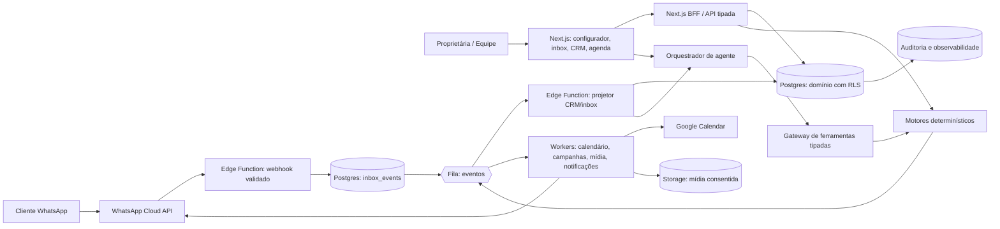
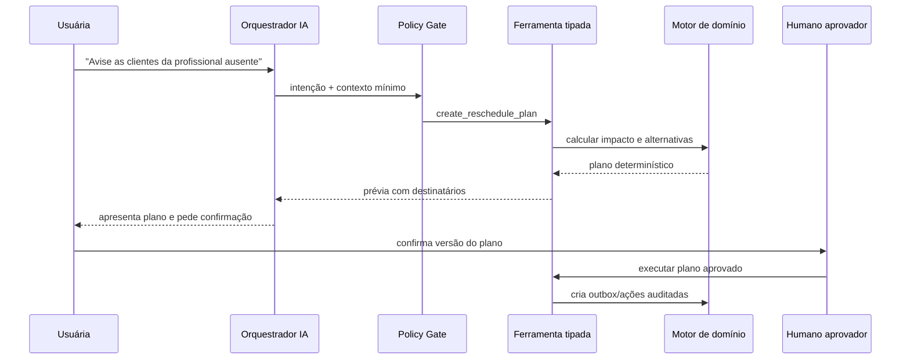

# Arquitetura Alvo — SaaS de Agente de IA para Negócios de Beleza

**Status:** arquitetura proposta; as capacidades abaixo não devem ser presumidas como implementadas.  
**Decisão:** evoluir o stack atual — Next.js/TypeScript, Supabase/Postgres/Auth/RLS/Edge Functions — sem criar outro backend grande antes de o domínio e os contratos exigirem essa extração. A fronteira de domínio deve ser independente da interface para permitir migração futura a NestJS/FastAPI sem reescrever regras.

## 1. Princípios de arquitetura

| Princípio | Decisão |
|---|---|
| Controle determinístico | Preço, duração, elegibilidade, agenda, desconto, sinal, permissão e campanha são serviços determinísticos; LLM não altera fatos. |
| Multiempresa por padrão | `tenant_id` no domínio, RLS forçada, contexto autenticado explícito e autorização antes da consulta/ferramenta. |
| Eventos idempotentes | Todo efeito externo possui chave de origem, correlação, outbox/inbox e retentativa segura. |
| Humanos nos pontos críticos | Química, imagem ambígua, preço sem regra, remarcação coletiva, desconto especial e campanha exigem revisão/confirmação conforme política. |
| Evolução por contrato | Serviço publicado, regra, template e plano de ação são versionados para explicar decisões históricas. |
| Privacidade mínima | Mensagens, fotos e histórico são minimizados; retenção e finalidade controlam uso e acesso. |

## 2. Topologia proposta

## 3. Camadas e responsabilidades

| Camada | Tecnologia inicial | Responsabilidade | Não pode fazer |
|---|---|---|---|
| Interface | Next.js/React/TypeScript | Configuração, agenda, inbox, CRM, aprovações e feedback de estado | Aplicar política crítica apenas no navegador |
| BFF/API | Routes/Server Actions tipadas no Next.js | Sessão, autorização, composição de dados e comandos síncronos | Acessar dado sem contexto tenant/role |
| Domínio | Módulos TypeScript puros e SQL transacional | Solver de agenda, cotação, recorrência, elegibilidade e máquinas de estado | Chamar LLM ou provedor externo dentro da transação |
| Dados | Supabase Postgres + RLS + migrations | Consistência, constraints compostas, auditoria e persistência | Guardar segredo externo no domínio |
| Integração | Supabase Edge Functions | Webhooks, OAuth callbacks, normalização de provedor e chamadas externas | Decidir regra comercial via payload externo |
| Assíncrono | Supabase Queues/Cron + workers | Projeções, envio, reconciliação, mídia, notificações e retry | Reprocessar efeito sem idempotência |
| IA | Orquestrador e gateway de ferramentas | Intenção, extração, resumo e resposta; plano com confirmação | SQL livre, mutação oculta ou decisão determinística |
| Observabilidade | Logs estruturados, métricas, alertas e auditoria | Correlação, segurança, erro, custo e operação | Expor mensagem/foto integral em logs |

## 4. Serviços de domínio obrigatórios

| Serviço | Entrada | Saída determinística |
|---|---|---|
| `QuoteService` | serviço/versão, variações, política, cliente | preço/duração, dependências, motivo ou `REVIEW_REQUIRED` |
| `AvailabilityService` | serviço composto, janela, unidade, profissional | alternativas válidas, conflitos e razão de rejeição |
| `ReservationService` | cotação, slot, idempotency key | reserva transacional, etapas e estado |
| `ExecutionService` | atendimento, etapas reais, responsável | execução, histórico técnico e evento de retorno |
| `EligibilityService` | cliente, regra de retorno/promoção | elegível/não elegível, razões e evidências |
| `CampaignService` | segmento, template, promoção | snapshot, destinatários, prévia e autorização necessária |
| `ConsentService` | evento de opt-in/out e finalidade | consentimento atual, histórico e bloqueios |
| `ActionPlanService` | intenção de proprietária e alvo | plano com impacto, pré-condições e exigência de aprovação |

Os serviços retornam valores tipados e razões de decisão. O agente pode narrar a razão, mas não troca o resultado.

## 5. Fluxos de dados críticos

### 5.1 WhatsApp para inbox e CRM

1. A Edge Function valida assinatura, identifica WABA/número e resolve o tenant; payload inválido ou não mapeado é rejeitado e auditado.
2. O webhook é persistido primeiro em `inbox_events` com chave idempotente e resposta rápida ao provedor.
3. Um worker consome a fila, normaliza contato, conversa, mensagem, status, opt-out e template; erros vão à DLQ.
4. O projetor emite `client_event` e atualiza apenas dados permitidos; não cria campanha nem toma ação comercial por conta própria.
5. A inbox e o agente leem a projeção, não o payload bruto do webhook.

### 5.2 Execução de serviço para CRM de retorno

1. Profissional conclui as etapas e o atendimento com autenticação/role adequados.
2. A transação cria `appointment_execution`, `stage_execution` e `client_technical_record`, sempre ligando versão do serviço.
3. Um evento de domínio aciona `EligibilityService`; o resultado materializado explica regra, janela e motivos.
4. A campanha só pode usar um resultado com consentimento e política de frequência atualizados antes do envio.

### 5.3 Campanha governada

1. Proprietária cria rascunho com segmento, promoção e template.
2. O motor avalia elegibilidade, monta `campaign_snapshot`, registra inclusão/exclusão e exibe prévia.
3. A proprietária aprova uma versão exata do snapshot/mensagem.
4. Worker revalida autorização, template, frequência e opt-out para cada destinatário, cria outbox e envia com chave idempotente.
5. Webhooks do provedor atualizam `SENT`, `DELIVERED`, `READ`, `FAILED` e preferências; o dashboard apresenta a auditoria.

## 6. Arquitetura de agentes

O agente usa recuperação limitada ao tenant e um conjunto de ferramentas allowlisted. Exemplos: `get_service_quote`, `find_available_slots`, `create_reservation_hold`, `get_client_history`, `build_campaign_preview` e `create_reschedule_plan`. Cada chamada recebe sessão, tenant, papel, input validado e `correlation_id`.

O modelo recebe somente contexto necessário à pergunta e nunca chaves, documentos inteiros, SQL, dados de outros tenants ou capacidade de decidir execução fora de ferramenta. Para imagem, o resultado é estruturado e não substitui avaliação profissional.

## 7. Integrações e contratos

| Integração | Contrato | Risco principal | Proteção |
|---|---|---|---|
| WhatsApp Cloud API | Webhook validado, template, status, opt-out e envio por outbox | Reentrega, template reprovado, excesso de contato | idempotência, snapshot, estado de template, frequência e DLQ |
| Google Calendar | OAuth por tenant, incremental sync, evento externo e reconciliação | Conflito/loop/expiração de token | chave de origem, cursor, lock e reconciliação periódica |
| Pagamento | intenção/sinal, callback assinado e estado de liquidação | duplicidade, fraude, confirmação tardia | webhook idempotente, estado separado e auditoria |
| STT | mídia consentida, transcrição assíncrona e confiança | falha, privacidade, custo | storage temporário, expiração, fallback humano |
| Visão | imagem consentida, schema de hipótese e confiança | erro de classificação, dado sensível | revisão humana, minimização e retenção curta |

## 8. Segurança, LGPD e resiliência

Fotos e histórico químico precisam de política específica de acesso, finalidade e retenção. A plataforma deve permitir exportação/eliminação do dado do titular, observando obrigações legais e auditoria. Dados de eventos permanecem com payload minimizado; arquivos ficam em storage privado, com URL temporária, chave por tenant e remoção assíncrona comprovável.

Toda fila deve ter tentativas limitadas, atraso progressivo, DLQ, painel de reprocessamento com permissão e alerta de falhas. A observabilidade deve medir atraso de webhook, erro por integração, fila pendente, reservas conflitantes, opt-out, falha de campanha, confiança visual, uso/custo de modelo e tempo de resposta por tenant.

## 9. Decisões que não devem ser adiadas

1. Modelo de dados versionado antes de implementar o catálogo técnico; improvisar estágios em JSON livre cria um motor impossível de testar.
2. `appointment_execution` antes de CRM de retorno; sem execução não existe “último procedimento” confiável.
3. Outbox/snapshot/consentimento antes de campanha; não há atalho seguro para “mandar promoção”.
4. Gateway de ferramentas e aprovação antes de agente do proprietário; chat com acesso direto a mutação é risco de produção.
5. Política de imagens e LGPD antes de upload; foto é dado pessoal, não um campo decorativo.
