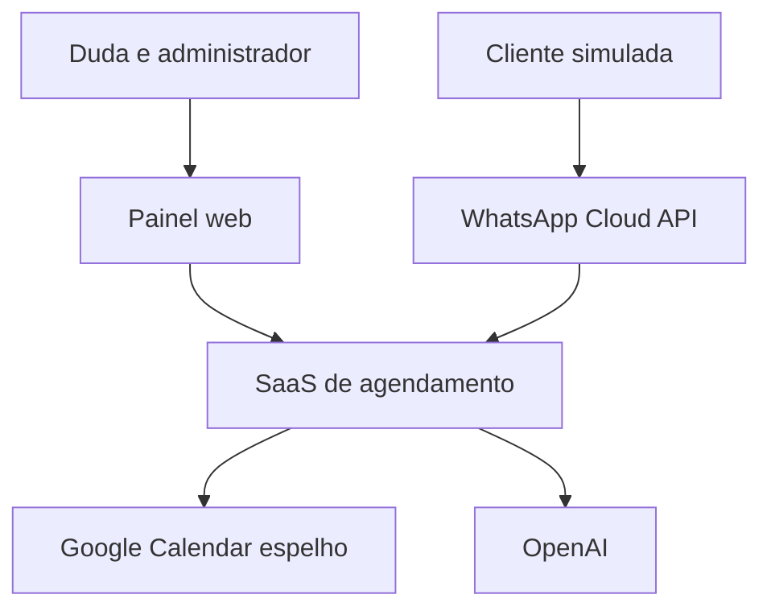
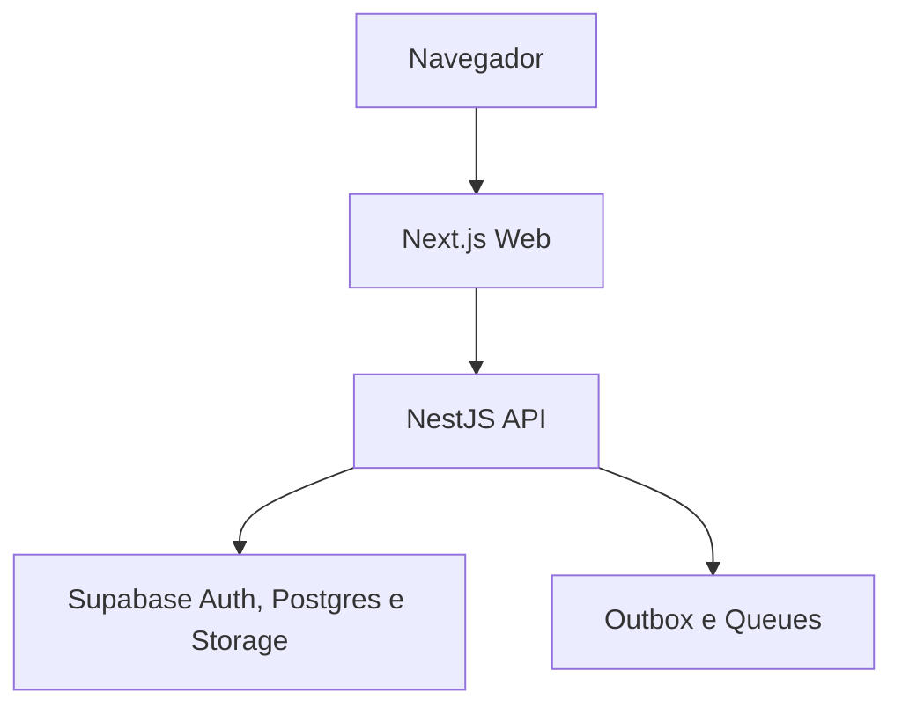
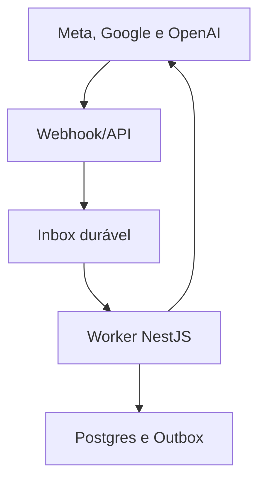
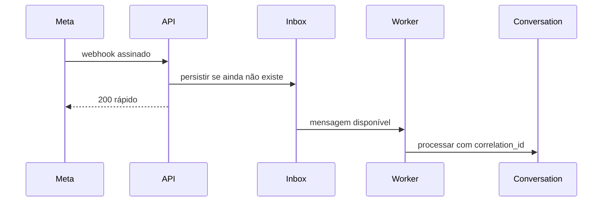
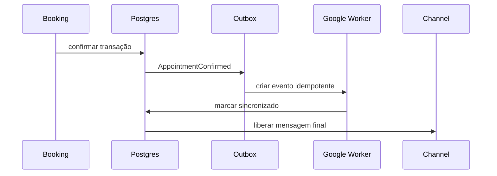

# Arquitetura Técnica do Piloto sem Sinal - v1.0

**Produto:** SaaS multiempresa de agente de IA para negócios de beleza  
**Data:** 03 de agosto de 2026  
**Status:** aprovado pela fundadora e congelado como baseline técnica  
**Aprovação:** 03 de agosto de 2026  
**Baselines canônicas:** `escopo-piloto-sem-sinal-v1.md`, `requisitos-piloto-v1.md` v1.1 e `modelo-dominio-configurador-v1.md` aprovado  
**Pilotos de referência:** Salão do William e Studio da Jack

## 1. Finalidade

Este documento transforma o domínio aprovado em uma arquitetura implementável para o piloto controlado. Ele define componentes, limites, contratos, fluxos, segurança, persistência, concorrência, integrações, implantação, observabilidade e critérios técnicos.

Ele não cria migrations, endpoints, telas nem infraestrutura. A implementação permanece bloqueada até a aprovação explícita desta arquitetura e a criação do backlog técnico fatiado.

## 2. Decisões herdadas e não reabertas

1. O produto é multiempresa desde a primeira migration; todo dado de negócio pertence a um `tenant_id`.
2. William e Jack são dados configuráveis de dois tenants, nunca condições pelo nome no código.
3. O configurador trabalha com rascunho, validação e publicação versionada.
4. O motor lê somente a configuração publicada e imutável.
5. Serviços simples e compostos usam o mesmo motor de etapas, pessoas e recursos.
6. A LLM interpreta e redige; não decide disponibilidade, duração, preço, política nem confirmação.
7. Cada estabelecimento usa um calendário Google espelho no piloto.
8. O WhatsApp fica restrito inicialmente ao número da Duda.
9. Sinal, pagamento e estado financeiro não participam do piloto.
10. Falha de Google, WhatsApp ou OpenAI deve terminar de forma segura e auditável.

## 3. Decisão arquitetural central

O piloto será construído como um **monólito modular com processamento assíncrono separado**:

- uma aplicação web;
- uma API modular;
- um worker persistente;
- um banco PostgreSQL/Supabase;
- uma fila interna durável;
- adaptadores separados para Google, WhatsApp e OpenAI.

A API e o worker serão processos implantáveis distintos, mas compartilharão contratos e módulos de domínio no monorepo.

### Por que não microserviços agora

Microserviços adicionariam descoberta, rede, autenticação entre serviços, tracing distribuído, deploys independentes, compatibilidade de contratos e mais pontos de falha antes de existir tráfego ou equipe que justifique esse custo.

O monólito modular preserva separação de responsabilidades sem impor complexidade operacional prematura. Um módulo só poderá ser extraído futuramente quando houver evidência de necessidade por escala, isolamento, disponibilidade ou cadência de mudança.

### Por que API e worker são processos separados

- A API precisa responder rapidamente a painel, OAuth e webhooks.
- O worker precisa executar sincronização, transcrição, OpenAI, envio de mensagens, expiração de reservas e reconciliação sem bloquear requisições.
- Uma falha ou pico de integração não deve derrubar o configurador nem prolongar a resposta de webhook.

## 4. Estilo e princípios

| Princípio                        | Aplicação obrigatória                                                              |
| -------------------------------- | ---------------------------------------------------------------------------------- |
| Monólito modular                 | Módulos com responsabilidade, interface e dependências explícitas.                 |
| Arquitetura hexagonal            | Domínio não importa SDK de Supabase, Google, Meta ou OpenAI.                       |
| Contratos primeiro               | OpenAPI, schemas Zod/JSON Schema e eventos versionados antes dos adaptadores.      |
| Fonte única de verdade           | PostgreSQL guarda configuração, ocupação, reserva e agendamento.                   |
| Consistência forte no núcleo     | Reserva e confirmação usam transação e constraints no banco.                       |
| Consistência eventual nas bordas | Calendário, WhatsApp e OpenAI usam filas, retries e reconciliação.                 |
| Falha fechada                    | Dúvida de configuração, calendário ou autorização bloqueia confirmação automática. |
| Idempotência                     | Todo comando externo repetível possui chave estável e efeito lógico único.         |
| Menor privilégio                 | Frontend, API, worker e integrações recebem credenciais e grants distintos.        |
| Observabilidade por correlação   | Uma solicitação mantém `correlation_id` do webhook ao evento de calendário.        |

## 5. Direcionadores e atributos de qualidade

| ID         | Atributo        | Cenário verificável                                                                         | Gate                       |
| ---------- | --------------- | ------------------------------------------------------------------------------------------- | -------------------------- |
| AQ-SEG-001 | Isolamento      | Usuário do tenant A tenta consultar ou alterar tenant B e recebe zero dados/negação.        | Antes de qualquer piloto.  |
| AQ-CON-001 | Concorrência    | Cem confirmações simultâneas para a última vaga geram no máximo um agendamento.             | Simulador.                 |
| AQ-IDM-001 | Idempotência    | O mesmo webhook é entregue várias vezes e produz uma mensagem e uma ação lógica.            | Integrações.               |
| AQ-FAL-001 | Confiabilidade  | Google, Meta ou OpenAI falha e nenhuma confirmação falsa é enviada.                         | Integrações.               |
| AQ-AUD-001 | Rastreabilidade | Uma confirmação é reconstruída da mensagem à versão, reserva e evento externo.              | Antes do piloto assistido. |
| AQ-EVO-001 | Evolução        | William e Jack usam os mesmos módulos e schemas sem ramificação pelo nome/segmento.         | Revisão de código.         |
| AQ-USA-001 | Usabilidade     | Cadastro salvo permanece após recarga e erro de prontidão abre o campo que o resolve.       | Configurador.              |
| AQ-OBS-001 | Operação        | Erro de fila, cálculo ou integração produz log, métrica e incidente correlacionado.         | Homologação.               |
| AQ-DSP-001 | Desempenho      | Metas p95 serão fixadas após benchmark do motor e antes do Gate D.                          | Spike técnico.             |
| AQ-PRV-001 | Privacidade     | Texto, áudio, mídia, payload e auditoria seguem políticas separadas de retenção e exclusão. | Antes de clientes reais.   |

Não será inventado um SLA comercial antes de medir o simulador. A implementação deve medir desde o primeiro cenário para que latência, throughput e disponibilidade sejam decididos com evidência.

## 6. Visão de contexto



Entidades externas não são fontes de regra de negócio. Google informa ocupações e recebe eventos; Meta transporta mensagens; OpenAI interpreta linguagem. O SaaS continua responsável por autorização, estado, cálculo, reserva e confirmação.

## 7. Visão de contêineres

### 7.1 Caminho síncrono



### 7.2 Caminho assíncrono



### 7.3 Responsabilidades

| Contêiner | Responsabilidade                                                           | Não pode fazer                                                |
| --------- | -------------------------------------------------------------------------- | ------------------------------------------------------------- |
| Web       | Configurador, simulador, agenda, inbox e administração                     | Conter segredo, `service_role` ou regra exclusiva de agenda.  |
| API       | Autenticar, autorizar, validar contratos, executar comandos e consultas    | Confiar em `tenant_id` enviado sem validar membership.        |
| Worker    | Consumir filas, integrar provedores, expirar reservas e reconciliar estado | Criar regra de negócio paralela aos módulos de domínio.       |
| Postgres  | Fonte de verdade, integridade, RLS, transações, ocupações e auditoria      | Depender de prompt ou disponibilidade de provedor externo.    |
| Storage   | Áudio, mídia e payloads protegidos com retenção                            | Servir arquivos sensíveis por URL pública permanente.         |
| OpenAI    | Intenção, extração estruturada, transcrição e redação                      | Confirmar agendamento ou executar SQL/integração diretamente. |

## 8. Stack selecionada

| Área               | Decisão                                                                                                                        |
| ------------------ | ------------------------------------------------------------------------------------------------------------------------------ |
| Monorepo           | `pnpm` workspaces + Turborepo                                                                                                  |
| Linguagem          | TypeScript em web, API, worker, contratos e motor                                                                              |
| Web                | Next.js + React                                                                                                                |
| UI                 | Tailwind CSS + shadcn/ui                                                                                                       |
| Formulários        | React Hook Form + Zod                                                                                                          |
| API                | NestJS com OpenAPI                                                                                                             |
| Banco/Auth/Storage | Supabase PostgreSQL, Auth e Storage privado                                                                                    |
| Acesso ao banco    | Cliente Supabase com JWT para operações do usuário; RPC transacional; pool server-side apenas para worker e operações internas |
| Fila               | Supabase Queues/PGMQ como transporte interno durável                                                                           |
| Jobs               | Worker persistente + Supabase Cron apenas para disparar rotinas curtas/recorrentes                                             |
| IA                 | OpenAI Responses API, function calling e Structured Outputs                                                                    |
| Tempo e fuso       | Temporal API/polyfill e fuso IANA da unidade                                                                                   |
| Testes             | Vitest, testes Postgres/pgTAP ou equivalente, Testcontainers e Playwright                                                      |
| Observabilidade    | OpenTelemetry, logs estruturados e Sentry ou equivalente                                                                       |
| CI/CD              | GitHub Actions com ambientes separados                                                                                         |

Versões exatas serão fixadas no scaffold, com lockfile versionado. Dependências não serão instaladas por `latest` em produção. A arquitetura também considera a depreciação anunciada de pin explícito de versão de extensões no Supabase; migrations não dependerão de `CREATE EXTENSION ... VERSION`.

## 9. Estrutura do monorepo

```text
apps/
  web/                 painel Next.js
  api/                 API e webhooks NestJS
  worker/              consumidores e jobs NestJS
packages/
  contracts/           OpenAPI, Zod, eventos e códigos de erro
  domain/              entidades, invariantes e casos de uso puros
  scheduling-engine/   compilador de etapas e motor determinístico
  database/            adapters, queries, RPCs e tipos gerados
  integrations/        portas e contratos comuns dos provedores
  observability/       logging, métricas, tracing e correlação
  test-kit/            factories, relógio, cenários e doubles
supabase/
  migrations/          evolução versionada do banco
  seed/                somente dados de desenvolvimento/teste
  tests/               RLS, constraints, RPCs e funções
docs/
  adr/                 decisões arquiteturais numeradas
  api/                 contratos e exemplos
```

Importações serão controladas: adaptadores dependem do domínio; o domínio nunca depende de framework ou SDK externo.

## 10. Módulos internos

| Módulo             | Responsabilidade                                        | Dependências permitidas                |
| ------------------ | ------------------------------------------------------- | -------------------------------------- |
| Identity & Tenancy | perfil, membership, papel, unidade e autorização        | Auth e banco                           |
| Configuration      | rascunho, revisão, checks, publicação, snapshot e hash  | Catálogo, Equipe e Recursos            |
| Workforce          | membros, habilidades, faixas, turnos e bloqueios        | Tenancy                                |
| Catalog            | serviços, variações, etapas, classificações e preparos  | Workforce e Resources                  |
| Resources          | recursos, slots, capacidade e indisponibilidade         | Tenancy                                |
| Scheduling         | candidatos, alocação, rejeição, ranking e plano         | Snapshot, ocupações e eventos externos |
| Booking            | hold, confirmação, cancelamento, remarcação e ocupações | Scheduling e banco transacional        |
| Conversation       | estado, fatos, pergunta seguinte, pausa e handoff       | Booking e portas de IA                 |
| Channel            | mensagens, allowlist, templates e status                | Conversation e Meta adapter            |
| Calendar           | conexão, mapeamento, eventos externos e reconciliação   | Google adapter e Booking               |
| Evidence           | auditoria, métricas, incidentes e correlação            | Todos por eventos                      |

Módulos se comunicam por chamadas internas tipadas para o caminho síncrono e por eventos versionados para efeitos assíncronos.

## 11. Arquitetura de dados e confiança

### 11.1 Schemas

| Schema    | Conteúdo                                                                       | Exposição                                                             |
| --------- | ------------------------------------------------------------------------------ | --------------------------------------------------------------------- |
| `public`  | Interfaces deliberadas: views seguras e RPCs necessárias ao produto            | Exposto com grants mínimos e RLS                                      |
| `app`     | Tabelas de negócio do modelo aprovado                                          | Não exposto diretamente ao navegador; RLS como defesa em profundidade |
| `private` | funções internas, referências de credenciais, payloads restritos e utilitários | Nunca exposto pela Data API                                           |
| `pgmq`    | filas e arquivos de mensagens                                                  | Somente API/worker; nunca cliente                                     |
| `storage` | metadados do Storage                                                           | Políticas por tenant e bucket privado                                 |

Se a configuração do Data API não expuser novos schemas automaticamente, grants serão explícitos. Exposição e RLS são controles diferentes; ambos serão testados.

### 11.2 Caminhos de acesso

- O navegador recebe somente chave publicável e token do usuário.
- Escritas de negócio passam pela API e por comandos/RPCs validados.
- Operações do usuário preservam o JWT para que RLS valide membership real.
- O worker usa um papel Postgres dedicado, sem `BYPASSRLS`, com grants mínimos e contexto de tenant fixado dentro da transação.
- `service_role` não é caminho normal de dados e nunca aparece no frontend.
- `user_metadata` não participa de autorização; membership e papel vêm do banco.
- Views expostas usam comportamento de invocador.
- Função `SECURITY DEFINER`, quando inevitável, fica em schema privado, fixa `search_path`, valida identidade/tenant e tem `EXECUTE` revogado de `PUBLIC`.

### 11.3 Integridade multiempresa

- `tenant_id NOT NULL` em toda tabela de negócio.
- Chaves estrangeiras compostas incluem `tenant_id` quando houver risco de associação cruzada.
- Policies usam membership ativa, não apenas `TO authenticated`.
- UPDATE possui `USING` e `WITH CHECK`.
- Testes cobrem leitura, inserção, edição, exclusão e RPC entre tenants.
- Jobs internos validam que evento, agregado e conexão pertencem ao mesmo tenant antes de agir.

## 12. Publicação da configuração

A publicação é um comando transacional:

1. Receber `draft_id` e `expected_revision`.
2. Bloquear o rascunho para edição concorrente.
3. Verificar autor, tenant, unidade e membership.
4. Executar todos os checks de prontidão na mesma revisão.
5. Compilar dados relacionais em snapshot canônico.
6. Excluir do snapshot segredos, dados de cliente, mídia e tokens.
7. Calcular hash SHA-256 do conteúdo canônico.
8. Inserir `configuration_version` imutável.
9. Atualizar `units.active_configuration_version_id`.
10. Marcar a versão anterior como substituída.
11. Invalidar opções ainda não escolhidas da versão anterior.
12. Gravar auditoria e evento `ConfigurationPublished` na outbox.
13. Confirmar a transação.

Se a revisão mudar entre validação e publicação, o comando falha com `CONFIGURATION_REVISION_CONFLICT`. A API não publica parcialmente.

## 13. Motor determinístico de agenda

### 13.1 Entrada

O motor recebe um objeto imutável e validado:

- `tenant_id` e `unit_id` autorizados;
- `configuration_version_id` e snapshot;
- serviço e variação resolvidos;
- fatos críticos da cliente confirmados;
- janela de busca;
- ocupações internas ativas;
- ocupações externas sincronizadas;
- instante de referência de um relógio injetável.

### 13.2 Pipeline

1. Interpretar a janela no fuso IANA da unidade.
2. Resolver variante, preparos e duração de cada etapa.
3. Compilar dependências em uma linha do tempo relativa.
4. Gerar inícios candidatos dentro do expediente.
5. Aplicar término máximo e exceções.
6. Encontrar membros aptos dentro dos turnos e fora de bloqueios.
7. Encontrar slots de recursos livres pelo intervalo real da etapa.
8. Considerar pausas que liberam pessoa e mantêm recurso.
9. Considerar eventos externos e bloqueios conservadores.
10. Rejeitar com códigos determinísticos cada violação.
11. Rankear somente candidatos válidos por critérios configurados.
12. Retornar opções com plano completo de etapas, pessoas e recursos.

O piloto começará com busca de intervalos e backtracking limitado, não com um solver genérico. Essa escolha reduz dependência e facilita explicar cada rejeição. Um solver especializado só será adotado se benchmark provar que o algoritmo não atende volume ou complexidade.

### 13.3 Pureza e reprodutibilidade

O pacote `scheduling-engine`:

- não acessa rede nem banco;
- não lê horário global diretamente;
- não chama LLM;
- recebe todas as entradas por parâmetro;
- produz o mesmo resultado para a mesma entrada;
- retorna códigos de rejeição, não texto livre;
- é executado pelo simulador e pelo fluxo real sem bifurcação.

## 14. Ledger unificado de ocupações

O modelo lógico possui registros específicos de hold e agendamento. Para impedir conflito entre eles no banco físico, haverá um ledger comum:

- `member_occupancies`;
- `resource_occupancies`.

Campos essenciais:

- `tenant_id`;
- `subject_id` (`member_id` ou `resource_slot_id`);
- `source_type` (`HOLD`, `APPOINTMENT`, `EXTERNAL_BLOCK` quando aplicável);
- `source_id`;
- `time_range` como `tstzrange`;
- `status` (`ACTIVE`, `RELEASED`, `EXPIRED`, `CANCELLED`);
- `expires_at` apenas para hold;
- `correlation_id`.

Uma exclusion constraint GiST impede sobreposição de intervalos ativos para o mesmo tenant e sujeito. O status, e não `now()`, controla o predicado da constraint.

### Conversão de hold em agendamento

1. Bloquear o hold e as ocupações em ordem estável.
2. Expirar holds vencidos encontrados no caminho.
3. Revalidar configuração, calendário, membros, recursos e exceções.
4. Criar agendamento e snapshots de etapas.
5. Alterar a origem das mesmas ocupações de `HOLD` para `APPOINTMENT`.
6. Marcar hold como convertido.
7. Gravar auditoria e outbox.
8. Confirmar tudo na mesma transação.

Não existe intervalo de liberação entre reserva e agendamento. Advisory locks ordenados por tenant/sujeito reduzem contenção; as constraints permanecem a proteção final.

## 15. Contratos HTTP e comandos

### 15.1 Convenções

- API versionada sob `/v1`.
- JSON validado por schema compartilhado.
- OpenAPI gerado e revisado no repositório.
- `Idempotency-Key` obrigatório em comandos repetíveis.
- `X-Correlation-Id` aceito ou gerado pela API.
- Datas absolutas em ISO 8601 UTC; horários semanais com fuso da unidade.
- Listas paginadas por cursor onde houver crescimento contínuo.
- Erros retornam `code`, `message`, `correlation_id` e `details` minimizados.

### 15.2 Superfícies principais

| Superfície        | Exemplos de comandos/consultas                                    |
| ----------------- | ----------------------------------------------------------------- |
| Configuração      | editar rascunho, validar, comparar, publicar, consultar prontidão |
| Equipe e recursos | cadastrar, editar, inativar, reativar, bloquear                   |
| Catálogo          | serviço, variação, etapa, preparo e classificação                 |
| Simulador         | buscar disponibilidade, explicar rejeição, criar hold de teste    |
| Booking           | confirmar, cancelar, iniciar remarcação e escolher alternativa    |
| Conversa          | consultar estado, pausar, retomar e transferir para humano        |
| Integrações       | iniciar OAuth, receber callback, testar conexão e reconciliar     |
| Operação          | consultar incidentes, auditoria e métricas autorizadas            |

Nenhum endpoint aceita `tenant_id` como autorização suficiente. O tenant solicitado precisa existir na membership ou na conexão externa autenticada.

## 16. Eventos, inbox, outbox e filas

### 16.1 Regra de entrega

O sistema assume entrega **ao menos uma vez** nas integrações e implementa efeito lógico **exatamente uma vez** por idempotência.

- Webhook é persistido na inbox antes do processamento.
- Fato de negócio e outbox são gravados na mesma transação.
- Worker marca tentativa, aplica retry com backoff e arquiva sucesso.
- Dead-letter lógico abre incidente e permite replay seguro.
- Replay preserva a chave original e não duplica ação.

### 16.2 Eventos iniciais

| Evento                         | Produtor      | Consumidores principais    |
| ------------------------------ | ------------- | -------------------------- |
| `ConfigurationPublished.v1`    | Configuration | Readiness, métricas, cache |
| `InboundMessageAccepted.v1`    | Channel       | Conversation               |
| `InboundMessageRejected.v1`    | Channel       | Auditoria                  |
| `AvailabilitySearched.v1`      | Scheduling    | Métricas                   |
| `ScheduleHoldCreated.v1`       | Booking       | Expiração e auditoria      |
| `ScheduleHoldExpired.v1`       | Booking       | Conversation               |
| `AppointmentConfirmed.v1`      | Booking       | Calendar                   |
| `AppointmentCancelled.v1`      | Booking       | Calendar e Channel         |
| `CalendarSyncRequested.v1`     | Calendar      | Worker Google              |
| `CalendarEventSynchronized.v1` | Calendar      | Booking e Channel          |
| `IntegrationFailed.v1`         | Adaptadores   | Incidentes e handoff       |

Payloads carregam IDs e dados mínimos; texto completo, token e mídia não circulam em eventos comuns.

## 17. Fluxo de WhatsApp e OpenAI



### 17.1 Entrada segura

1. Validar challenge e autenticidade conforme o contrato oficial da Meta.
2. Identificar conta/canal e tenant pelo identificador externo, não pelo payload do cliente.
3. Deduplicar por provedor, conta e ID da mensagem.
4. Normalizar contato e aplicar allowlist antes de OpenAI ou download de mídia desnecessário.
5. Para número não autorizado, não iniciar conversa automática; registrar rejeição mínima.
6. Persistir e responder ao webhook rapidamente.

### 17.2 Interpretação

- Texto ou transcrição entra na OpenAI Responses API.
- Saída usa Structured Outputs ou function calling com schema estrito.
- Modelo retorna intenção, fatos candidatos, confiança e necessidade de pergunta/handoff.
- Fatos que afetam duração, preço ou agenda precisam de validação/confirmação conforme regra.
- O orquestrador, e não a LLM, decide qual comando interno autorizado executar.
- Toda função confere estado da conversa, autorização e pré-condições novamente.
- A resposta final usa somente dados retornados pelos motores.

O modelo será configurável por ambiente e selecionado por avaliação de qualidade, latência e custo. A arquitetura não fixa nome de modelo no domínio. Quando compatível com o fluxo e a política de dados, usar `store: false`.

### 17.3 Áudio

1. Baixar mídia apenas após allowlist.
2. Armazenar temporariamente em bucket privado.
3. Transcrever de forma assíncrona.
4. Vincular transcrição à mensagem e preservar confiança/status.
5. Não ecoar a transcrição para a cliente.
6. Aplicar política própria de retenção ao arquivo original.

## 18. Google Calendar espelho

### 18.1 Autorização e escopo

- OAuth por tenant/conexão.
- Escopos mínimos necessários ao calendário espelho.
- Token criptografado por envelope; banco guarda referência/valor cifrado, nunca token em log.
- Um mapeamento principal por tenant no piloto; domínio permite vários no futuro.

### 18.2 Sincronização

1. Executar full sync inicial e persistir `nextSyncToken`.
2. Receber notificação de mudança.
3. Enfileirar sync incremental.
4. Persistir novo token somente após aplicar todas as páginas.
5. Tratar exclusões e cancelamentos.
6. Se o token expirar ou Google responder que não é mais válido, limpar cursor e repetir full sync.
7. Renovar canais de notificação antes da expiração.
8. Executar reconciliação periódica mesmo quando webhooks parecem saudáveis.

Eventos externos não correlacionados bloqueiam a unidade inteira no intervalo até classificação. Essa decisão é conservadora e evita supor capacidade interna a partir de uma agenda única.

### 18.3 Confirmação e mensagem final



Antes da transação, a saúde e a atualidade da sincronização precisam estar dentro da tolerância aprovada. A mensagem que afirma confirmação só é liberada após o evento espelho ser criado/atualizado com sucesso. Se a sincronização falhar, a ocupação interna permanece protegida, o sistema não afirma confirmação e abre retry/handoff.

## 19. Segurança e LGPD por desenho

### 19.1 Controles obrigatórios

- Ambientes local, homologação e produção em projetos separados.
- MFA obrigatório para contas administrativas de produção quando disponível.
- Segredos somente em secret manager do ambiente.
- Criptografia por envelope para credenciais por tenant e rotação de chave.
- Buckets privados e URLs assinadas de curta duração.
- Logs sem texto integral, token, áudio ou imagem.
- Auditoria append-only para publicação, permissão, reserva, confirmação e integração.
- Rate limiting por IP, conexão, tenant e contato conforme superfície.
- Proteção contra abuso em Auth e endpoints públicos.
- Dependências fixadas, lockfile e análise de vulnerabilidade no CI.
- Backup e restauração testada antes de clientes reais.

### 19.2 Dados e retenção

As categorias terão políticas independentes:

| Categoria               | Finalidade                             | Decisão necessária antes de clientes reais |
| ----------------------- | -------------------------------------- | ------------------------------------------ |
| Mensagem de atendimento | Executar e provar o atendimento        | Prazo e base legal                         |
| Áudio original          | Transcrição e evidência temporária     | Prazo curto e descarte após processamento  |
| Transcrição             | Interpretar intenção e manter contexto | Prazo e acesso                             |
| Foto/mídia              | Apoio a análise humana futura          | Consentimento e prazo                      |
| Payload bruto           | Diagnóstico de integração              | Minimização e prazo curto                  |
| Auditoria               | Segurança, disputa e rastreabilidade   | Prazo compatível com finalidade            |
| Métricas                | Qualidade e operação                   | Agregação/pseudonimização                  |

Prazos exatos permanecem decisão de Segurança/LGPD antes do Gate D. O schema e os jobs já devem suportar `retention_until`, legal hold quando aplicável, exportação, correção e exclusão auditável.

## 20. Observabilidade e operação

### 20.1 Correlação

O mesmo `correlation_id` acompanha:

- webhook;
- inbox;
- mensagem;
- conversa;
- chamada OpenAI;
- busca de agenda;
- hold;
- agendamento;
- outbox;
- operação Google;
- envio WhatsApp;
- incidente.

### 20.2 Telemetria mínima

- latência e taxa de erro por endpoint;
- tempo e candidatos avaliados por busca;
- códigos de rejeição do motor;
- holds criados, expirados, convertidos e liberados;
- conflitos barrados por constraint;
- profundidade, idade e retries de fila;
- falhas por provedor e estado de circuit breaker;
- atraso desde última sincronização Google;
- webhooks duplicados;
- custo/tokens e latência de OpenAI por tarefa;
- mensagens enviadas, entregues, lidas e falhas;
- violações ou negações de autorização;
- versão da configuração por erro.

Alertas serão baseados em risco: isolamento, fila parada, calendário desatualizado, falha de confirmação e esgotamento de retries têm prioridade sobre métricas comerciais.

## 21. Estratégia de falhas

| Falha                                     | Comportamento seguro                                                 |
| ----------------------------------------- | -------------------------------------------------------------------- |
| Configuração inválida                     | Bloquear busca e abrir erro específico no configurador.              |
| OpenAI indisponível                       | Não inventar interpretação; retry limitado ou handoff.               |
| Transcrição inconclusiva                  | Pedir texto/repetição ou handoff, sem ecoar suposição.               |
| Google desatualizado                      | Bloquear confirmação automática.                                     |
| Escrita Google falha após reserva interna | Manter ocupação protegida, retry e handoff; não afirmar confirmação. |
| Meta indisponível                         | Manter outbox e retry; não repetir agendamento.                      |
| Webhook duplicado                         | Retornar sucesso e reutilizar resultado lógico.                      |
| Hold expira                               | Liberar ocupações, recalcular e oferecer novas opções.               |
| Publicação concorrente                    | Rejeitar revisão antiga e exigir recarga/comparação.                 |
| Tentativa cross-tenant                    | Negar, auditar e alertar conforme gravidade.                         |
| Dead-letter                               | Abrir incidente com replay autorizado e idempotente.                 |

## 22. Implantação por ambiente

| Ambiente            | Objetivo                                                 | Integrações                                         |
| ------------------- | -------------------------------------------------------- | --------------------------------------------------- |
| Local               | Desenvolvimento e testes rápidos                         | Emuladores/doubles; Supabase local quando aplicável |
| Homologação         | Calendários espelho, número da Duda e cenários completos | Sandboxes/contas de teste reais                     |
| Produção controlada | Piloto assistido após QA e Segurança                     | Conexões reais aprovadas e allowlist                |

Topologia recomendada:

- Web em plataforma otimizada para Next.js.
- API e worker em serviço com processos persistentes, health checks e deploy independente.
- Supabase gerenciado por ambiente.
- Região escolhida para minimizar latência entre API, worker e banco.
- Migração executada como job único e bloqueante antes do rollout da nova versão.
- Rollback de aplicação não executa rollback destrutivo automático do banco.

O provedor exato de hospedagem da API/worker pode ser escolhido no backlog de infraestrutura sem alterar esta arquitetura, desde que suporte processo persistente, rede segura, secrets, autoscaling controlado e observabilidade.

## 23. CI/CD e gates técnicos

Cada pull request deve executar:

1. lint e formatação;
2. verificação TypeScript;
3. testes unitários do domínio e motor;
4. testes de contratos;
5. banco local limpo + todas as migrations;
6. testes de constraints e RLS;
7. testes de integração da API;
8. Playwright dos caminhos críticos quando a UI existir;
9. scan de dependências e segredos;
10. geração comparada de OpenAPI e tipos.

Deploy em homologação exige migrations e testes verdes. Produção exige aprovação manual, backup verificado, plano de reversão e evidências dos gates correspondentes.

## 24. Estratégia de testes

| Camada    | Prova principal                                                       |
| --------- | --------------------------------------------------------------------- |
| Domínio   | Invariantes e precedência sem framework                               |
| Motor     | Casos do William e Jack, property-based e relógio controlado          |
| Banco     | RLS, FKs compostas, constraints de sobreposição e transações          |
| API       | Autorização, contratos, idempotência e códigos de erro                |
| Filas     | duplicidade, retry, backoff, dead-letter e replay                     |
| Google    | full sync, incremental, exclusão, token inválido e reconciliação      |
| WhatsApp  | assinatura, allowlist, duplicidade, status e falhas                   |
| OpenAI    | aderência ao schema, recusa, ambiguidade, custo e regressão por evals |
| UI        | visível, editável, persistente, aplicado, erro tratado e responsivo   |
| Segurança | tenant A contra B, grants, secrets, storage e papéis                  |

O motor deverá receber testes gerados para invariantes como: nenhum plano termina depois do limite; nenhuma etapa usa pessoa fora do turno; nenhuma ocupação ativa se sobrepõe para o mesmo sujeito; toda opção é reproduzível pela versão registrada.

## 25. Decisões arquiteturais registradas

| ADR     | Decisão                                                                | Estado              |
| ------- | ---------------------------------------------------------------------- | ------------------- |
| ADR-001 | Monólito modular, API e worker como processos separados                | Aprovada            |
| ADR-002 | TypeScript compartilhado e contratos primeiro                          | Aprovada            |
| ADR-003 | Supabase/Postgres como fonte de verdade                                | Herdada e detalhada |
| ADR-004 | Configuração publicada como snapshot imutável                          | Herdada e detalhada |
| ADR-005 | Motor puro com busca de intervalos/backtracking limitado               | Aprovada            |
| ADR-006 | Ledger físico unificado de ocupações com exclusion constraints         | Aprovada            |
| ADR-007 | Escritas de negócio pelo backend/RPC, sem CRUD irrestrito do navegador | Aprovada            |
| ADR-008 | Inbox/outbox + PGMQ para bordas assíncronas                            | Aprovada            |
| ADR-009 | Responses API e saída estruturada; LLM fora da decisão operacional     | Aprovada            |
| ADR-010 | Calendário espelho, sync incremental e reconciliação                   | Herdada e detalhada |
| ADR-011 | Mensagem final somente após sincronização externa bem-sucedida         | Aprovada            |
| ADR-012 | Sinal e pagamento ausentes do domínio do piloto                        | Herdada             |

Cada decisão aprovada deverá virar um arquivo ADR versionado durante o scaffold. Uma mudança futura precisa registrar motivo, impacto e migração; não basta alterar código.

## 26. Alternativas rejeitadas nesta fase

| Alternativa                             | Motivo da rejeição                                                                                |
| --------------------------------------- | ------------------------------------------------------------------------------------------------- |
| Microserviços                           | Custo operacional sem escala/equipe que o justifique.                                             |
| Somente Edge Functions                  | Worker, conexões, filas e domínio complexo pedem runtime persistente e testável.                  |
| Google Calendar como banco principal    | Não representa etapas, recursos, versões, holds e concorrência interna.                           |
| LLM calculando agenda                   | Não é determinística nem prova restrições completas.                                              |
| CRUD direto e irrestrito do frontend    | Espalha regra, dificulta auditoria e aumenta superfície de autorização.                           |
| Uma tabela por tenant                   | Torna migrations, consultas e operação inviáveis; isolamento é por `tenant_id` + RLS.             |
| Polling como única sincronização        | Aumenta atraso/custo e ainda exige reconciliação; usar notificação + incremental + reconciliação. |
| Confirmar antes de reservar             | Permite corrida e dupla reserva.                                                                  |
| Liberar hold antes de criar agendamento | Cria janela de concorrência.                                                                      |

## 27. Rastreabilidade

| Decisão arquitetural     | Origem principal                         |
| ------------------------ | ---------------------------------------- |
| RLS, membership e tenant | RF-TEN-002/005, RNF-SEG-001/002, CA-006  |
| Snapshot publicado       | Modelo 5 e 6.2, RF-CFG-004 a 007         |
| Motor puro               | RF-AGE-001 a 008, RN-007/008             |
| Ledger e constraints     | RF-AGE-009 a 011, RNF-CON-001, CA-004    |
| Inbox/outbox             | RF-AUD-003/004, RNF-IDM-001, RNF-OBS-001 |
| Google incremental       | RF-GCA-001 a 007, CA-005                 |
| WhatsApp restrito        | RF-WHA-001 a 006, DEC-006                |
| OpenAI estruturada       | RF-CON-002 a 007, RNF-FAL-001            |
| Retenção separada        | RNF-PRV-001                              |
| Sem pagamento            | DEC-005, RF-AGD-006, RN-001              |

## 28. Situação honesta após este documento

| Item                           | Estado                                                                         |
| ------------------------------ | ------------------------------------------------------------------------------ |
| Escopo                         | Aprovado                                                                       |
| Requisitos                     | Documentados e consolidados para arquitetura; pendências operacionais isoladas |
| Modelo de domínio/configurador | Aprovado                                                                       |
| Arquitetura técnica            | Aprovada e congelada como baseline em 03/08/2026                               |
| ADRs individuais               | Ainda não criados                                                              |
| Backlog técnico                | Ainda não criado                                                               |
| Banco e migrations             | Não implementados                                                              |
| API e motor                    | Não implementados                                                              |
| Google, WhatsApp e OpenAI      | Não conectados                                                                 |
| Testes executados              | Nenhum teste de produto executado                                              |

## 29. Critérios de aceite da arquitetura

A arquitetura será aceita quando:

1. preservar integralmente o escopo sem sinal;
2. representar William e Jack pelo mesmo conjunto de módulos;
3. separar LLM, motor determinístico e ação humana;
4. impedir conflito entre hold e agendamento também no banco;
5. proteger tenant em navegador, API, worker, banco, storage e filas;
6. definir falha segura e idempotência para cada integração;
7. manter Google como espelho, não como fonte única de capacidade;
8. permitir rastrear confirmação ponta a ponta;
9. permitir implantação e testes por fatias sem microserviços prematuros;
10. não declarar nenhuma integração ou função como pronta sem evidência.

## 30. Registro de aprovação e próximo gate

Em 03 de agosto de 2026, a fundadora aprovou explicitamente esta arquitetura como baseline para a criação do backlog técnico.

O próximo gate é a aprovação de `backlog-tecnico-piloto-v1.md`. A implementação da primeira fatia vertical permanece bloqueada até esse backlog fixar ordem, dependências, critérios de aceite e evidências de conclusão.

## 31. Referências técnicas consultadas

- [Supabase - Row Level Security](https://supabase.com/docs/guides/database/postgres/row-level-security)
- [Supabase - Securing your data](https://supabase.com/docs/guides/database/secure-data)
- [Supabase Queues - Quickstart](https://supabase.com/docs/guides/queues/quickstart)
- [Supabase - Changelog](https://supabase.com/changelog)
- [OpenAI - Migrate to the Responses API](https://developers.openai.com/api/docs/guides/migrate-to-responses)
- [OpenAI - Function calling](https://developers.openai.com/api/docs/guides/function-calling)
- [OpenAI - Structured Outputs](https://developers.openai.com/api/docs/guides/structured-outputs)
- [Google Calendar - Incremental synchronization](https://developers.google.com/workspace/calendar/api/guides/sync)
- [Meta - WhatsApp Cloud API webhooks](https://developers.facebook.com/documentation/business-messaging/whatsapp/webhooks/overview)
- Materiais anexados `Arquitetura de software - CW1` a `CW4`: fundamentos, visões, atributos de qualidade, técnicas, modelos e princípios de design.
