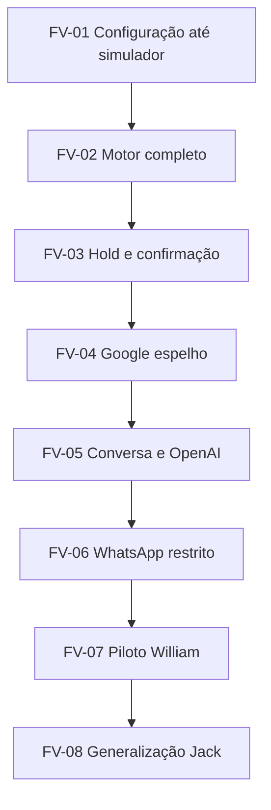

# Backlog Técnico do Piloto sem Sinal - v1.0

**Produto:** SaaS multiempresa de agente de IA para negócios de beleza  
**Data:** 03 de agosto de 2026  
**Status:** aprovado pela fundadora; FV-01 autorizada e em implementação  
**Aprovação:** 03 de agosto de 2026  
**Baselines canônicas:** `escopo-piloto-sem-sinal-v1.md`, `requisitos-piloto-v1.md` v1.1, `modelo-dominio-configurador-v1.md` e `arquitetura-tecnica-piloto-v1.md` aprovados  
**Pilotos de referência:** Salão do William e Studio da Jack

## 1. Finalidade

Transformar a arquitetura aprovada em uma sequência implementável de fatias verticais, com dependências, critérios de aceite, evidências e gates explícitos.

Este backlog não declara banco, API, telas, motor ou integrações como concluídos. Nenhum item recebe estado `DONE` sem código versionado e evidência de teste.

## 2. Decisões que este backlog preserva

1. Multiempresa e isolamento por `tenant_id` começam na primeira migration.
2. William e Jack são dados de configuração; nomes de piloto não podem controlar regra de produção.
3. A LLM não calcula agenda, duração, preço nem confirmação.
4. O motor usa somente configuração publicada e imutável.
5. Serviços simples e compostos usam o mesmo modelo de etapas.
6. Hold e agendamento disputam um ledger físico comum de ocupações.
7. Google Calendar é espelho externo, não fonte única de capacidade.
8. WhatsApp começa restrito ao número da Duda.
9. Sinal e pagamento permanecem ausentes do piloto.
10. O próximo incremento só começa quando o gate anterior possuir evidência suficiente.

## 3. Estados e regra de honestidade

| Estado        | Significado                                                              |
| ------------- | ------------------------------------------------------------------------ |
| `BACKLOG`     | Especificado, mas não iniciado.                                          |
| `READY`       | Dependências e critérios de aceite resolvidos.                           |
| `IN_PROGRESS` | Existe implementação local ou em branch ainda não validada.              |
| `IN_REVIEW`   | Código completo para o escopo do item e aguardando revisão/QA.           |
| `BLOCKED`     | Existe impedimento identificado e registrado.                            |
| `DONE`        | Código versionado, testes executados, evidência anexada e gate atendido. |

Rótulos adicionais são obrigatórios para integrações:

- `MOCK`: provedor substituído por double controlado;
- `SANDBOX_CONNECTED`: credencial e evento real comprovados em homologação;
- `CONTROLLED_PRODUCTION`: conexão real limitada e aprovada para o piloto;
- `PRODUCTION`: uso comercial, fora do escopo deste backlog.

## 4. Ordem de execução

Não é permitido conectar WhatsApp antes de o simulador e a concorrência estarem aprovados. Não é permitido abrir o piloto William antes de Google, falhas seguras, retenção e isolamento terem passado pelos gates.

## 5. Visão executiva das fatias

| Fatia | Resultado verificável                                        | Integrações                         | Gate de saída |
| ----- | ------------------------------------------------------------ | ----------------------------------- | ------------- |
| FV-01 | Dois tenants configuram, publicam e simulam pelo mesmo motor | Tudo em `MOCK`                      | Gate A        |
| FV-02 | Motor cobre regras completas do salão e do studio            | Google ainda `MOCK`                 | Gate B        |
| FV-03 | Hold e confirmação transacionais impedem dupla reserva       | Provedores ainda `MOCK`             | Gate C        |
| FV-04 | Calendário Google espelho sincroniza e reconcilia            | Google `SANDBOX_CONNECTED`          | Gate D        |
| FV-05 | Texto é interpretado por schema e orquestrado com segurança  | OpenAI `SANDBOX_CONNECTED`          | Gate E        |
| FV-06 | Texto e áudio trafegam pelo número permitido                 | WhatsApp/OpenAI `SANDBOX_CONNECTED` | Gate F        |
| FV-07 | Cenários do William são executados em operação assistida     | Ambiente controlado                 | Gate G        |
| FV-08 | Jack prova generalização sem ramificação de código           | Ambiente controlado                 | Gate H        |

Estimativa de planejamento para chegar ao piloto real controlado: **245 a 400 horas**, sujeita a reestimativa após o benchmark da FV-01. A faixa não é promessa comercial nem prazo fechado.

## 6. FV-01 - Primeira fatia vertical implementável

### 6.1 Objetivo

Provar o fluxo completo:

> autenticar → selecionar tenant autorizado → editar configuração em rascunho → validar → publicar versão imutável → executar o mesmo motor no simulador → exibir opções e rejeições explicáveis

### 6.2 Escopo funcional mínimo

- Dois tenants de teste: William e Jack.
- Um usuário com memberships explícitas e troca controlada de contexto.
- Uma unidade com fuso IANA por tenant.
- Faixas semanais e término máximo.
- Participantes com disponibilidade fixa.
- Uma habilidade operacional.
- Recurso com capacidade 1.
- Serviço simples e serviço composto com etapas ordenadas.
- Duração por etapa.
- Alocação de participante e recurso por etapa.
- Etapa capaz de liberar pessoa e manter recurso ocupado.
- Rascunho, revisão otimista, checks de prontidão, snapshot, hash e publicação.
- Simulador por serviço e janela de datas.
- Resultado com horários válidos, plano de etapas e códigos de rejeição.
- Persistência após recarga.
- Auditoria mínima e `correlation_id`.

### 6.3 Fora da FV-01

- Hold, confirmação, cancelamento e remarcação.
- Ledger de ocupações definitivas.
- Google Calendar real.
- WhatsApp, áudio e OpenAI.
- Assistente dinâmica e turnos ocasionais.
- Exceções fora do expediente.
- Preparos como teste de mechas.
- Classificação completa de cabelo e todas as variações de duração/preço.
- Clientes reais.

Esses itens continuam no piloto; apenas não pertencem à primeira fatia.

### 6.4 Backlog da FV-01

#### Fundação e contratos

| ID     | Entrega                                                                                     | Dependência      | Critério de aceite                                                                      | Evidência exigida                            |
| ------ | ------------------------------------------------------------------------------------------- | ---------------- | --------------------------------------------------------------------------------------- | -------------------------------------------- |
| BT-001 | Criar monorepo `pnpm`/Turborepo com `web`, `api`, `worker` e pacotes aprovados              | Backlog aprovado | Builds independentes e importações respeitam limites arquiteturais                      | Commit, árvore, build e teste de dependência |
| BT-002 | Fixar versões, lockfile, lint, TypeScript e formatação                                      | BT-001           | Instalação reproduzível e CI falha em erro de tipo/lint                                 | Lockfile e execução do pipeline              |
| BT-003 | Criar contratos base: IDs, datas UTC, fuso IANA, erro, paginação, idempotência e correlação | BT-001           | API e domínio compartilham tipos sem importar framework no domínio                      | Testes de schema e OpenAPI gerado            |
| BT-004 | Criar relógio, gerador de IDs e logger injetáveis                                           | BT-003           | Testes controlam tempo e correlação sem usar relógio global no motor                    | Testes unitários determinísticos             |
| BT-005 | Configurar ambientes `local`, `homologação` e `produção` sem compartilhar segredos          | BT-001           | Variáveis públicas não contêm chave privilegiada; configuração ausente falha no startup | Scan de segredos e testes de configuração    |

#### Banco, tenancy e autorização

| ID     | Entrega                                                                                           | Dependência | Critério de aceite                                                    | Evidência exigida                             |
| ------ | ------------------------------------------------------------------------------------------------- | ----------- | --------------------------------------------------------------------- | --------------------------------------------- |
| BT-010 | Criar schemas `app` e `private` e extensões estritamente necessárias                              | BT-002      | Migrations sobem do zero e não expõem tabelas internas por padrão     | Log de migration limpa e grants inspecionados |
| BT-011 | Implementar `tenants`, `units`, `profiles`, `tenant_memberships`, papéis mínimos e auditoria base | BT-010      | Toda entidade de negócio possui `tenant_id NOT NULL` e FKs seguras    | Migration, diagrama e testes de constraint    |
| BT-012 | Implementar RLS e policies de membership                                                          | BT-011      | Tenant A não lê, insere, altera nem exclui dado de B                  | Suíte positiva e cross-tenant automatizada    |
| BT-013 | Implementar autenticação e resolução server-side do tenant ativo                                  | BT-012      | `tenant_id` enviado pelo cliente não concede acesso sem membership    | Testes de API 401/403/404 sem vazamento       |
| BT-014 | Criar tela mínima de seleção de tenant autorizado                                                 | BT-013      | Usuário vê apenas memberships ativas e mudança de contexto é auditada | Playwright e registro de auditoria            |

#### Configuração versionada

| ID     | Entrega                                                                                            | Dependência | Critério de aceite                                                         | Evidência exigida                             |
| ------ | -------------------------------------------------------------------------------------------------- | ----------- | -------------------------------------------------------------------------- | --------------------------------------------- |
| BT-020 | Implementar rascunho e revisão otimista                                                            | BT-012      | Duas edições concorrentes não sobrescrevem silenciosamente                 | Teste de `CONFIGURATION_REVISION_CONFLICT`    |
| BT-021 | Implementar entidades mínimas de unidade, expediente, equipe, habilidade, recurso, serviço e etapa | BT-020      | William e Jack são cadastráveis pelo mesmo schema                          | Migrations e testes de integridade            |
| BT-022 | Implementar comandos de criar, editar, inativar e excluir cadastro sem histórico                   | BT-021      | Exclusão pede confirmação e inativação preserva referência histórica       | Testes de API e interface                     |
| BT-023 | Implementar checks mínimos de prontidão com códigos estáveis                                       | BT-021      | Configuração incompleta lista campos bloqueantes e não pode publicar       | Testes por código de prontidão                |
| BT-024 | Implementar publicação transacional com snapshot, hash e versão imutável                           | BT-023      | Revisão válida publica por inteiro; versão publicada não é editável        | Testes de transação, imutabilidade e hash     |
| BT-025 | Implementar ponteiro de configuração ativa por unidade                                             | BT-024      | Motor lê somente a versão ativa; editar novo rascunho não altera resultado | Teste comparando antes/depois da republicação |

#### Painel configurador mínimo

| ID     | Entrega                                                           | Dependência    | Critério de aceite                                                    | Evidência exigida                   |
| ------ | ----------------------------------------------------------------- | -------------- | --------------------------------------------------------------------- | ----------------------------------- |
| BT-030 | Criar navegação do configurador e indicador de rascunho/publicado | BT-014, BT-020 | Estado e versão ficam visíveis sem confundir rascunho com produção    | Playwright desktop e viewport móvel |
| BT-031 | Criar formulários de unidade e expediente                         | BT-021         | Salvar, cancelar, editar, recarregar e validar funcionam              | Playwright e consulta persistida    |
| BT-032 | Criar formulários de equipe, habilidade e disponibilidade fixa    | BT-021         | Participante inativo não entra em nova configuração publicada         | Playwright e teste do domínio       |
| BT-033 | Criar formulários de recurso, serviço e etapas                    | BT-021         | Serviço composto mantém ordem, duração, pessoa e recurso por etapa    | Playwright e snapshot publicado     |
| BT-034 | Criar tela de prontidão, diferenças e confirmação de publicação   | BT-023, BT-024 | Erro abre o campo responsável; publicação exige confirmação explícita | Playwright do caminho feliz e erro  |

#### Motor determinístico e simulador

| ID     | Entrega                                                           | Dependência            | Critério de aceite                                                      | Evidência exigida                          |
| ------ | ----------------------------------------------------------------- | ---------------------- | ----------------------------------------------------------------------- | ------------------------------------------ |
| BT-040 | Compilar snapshot publicado em linha do tempo de etapas           | BT-025                 | Mesma entrada produz o mesmo plano relativo                             | Testes unitários com relógio controlado    |
| BT-041 | Gerar candidatos dentro do expediente e aplicar término máximo    | BT-040                 | Candidato que termina após o limite é rejeitado                         | Testes CA-002 e bordas de fuso             |
| BT-042 | Alocar participante e recurso por etapa                           | BT-040                 | Pessoa fora do turno ou recurso sem capacidade invalida candidato       | Testes unitários e property-based iniciais |
| BT-043 | Implementar pausa que libera pessoa e mantém recurso              | BT-042                 | Pessoa pode ser reutilizada; recurso de capacidade 1 não                | Teste CA-003                               |
| BT-044 | Retornar opções e rejeições com códigos, sem texto livre no motor | BT-041, BT-043         | API apresenta resposta versionada e reproduzível                        | Testes de contrato e snapshot              |
| BT-045 | Criar endpoint autorizado de simulação                            | BT-013, BT-025, BT-044 | Tenant só simula a própria configuração ativa                           | Testes de API e cross-tenant               |
| BT-046 | Criar tela do simulador com plano e explicação das rejeições      | BT-034, BT-045         | Alteração publicada muda o resultado; alteração só em rascunho não muda | Playwright ponta a ponta                   |

#### Evidência, qualidade e segurança da fatia

| ID     | Entrega                                                              | Dependência     | Critério de aceite                                                         | Evidência exigida                               |
| ------ | -------------------------------------------------------------------- | --------------- | -------------------------------------------------------------------------- | ----------------------------------------------- |
| BT-050 | Criar fixtures de William e Jack apenas em `test-kit`/seed de teste  | BT-021          | Nenhum nome de piloto aparece em regra de `domain` ou `scheduling-engine`  | Busca automatizada e revisão de código          |
| BT-051 | Instrumentar auditoria, correlação, latência e rejeições do motor    | BT-024, BT-045  | Publicação e simulação podem ser reconstruídas por `correlation_id`        | Teste de integração e amostra de log minimizado |
| BT-052 | Executar teste de isolamento em todas as tabelas e comandos da fatia | BT-012 a BT-046 | Zero acesso cross-tenant em leitura e escrita                              | Relatório automatizado de Segurança             |
| BT-053 | Executar matriz de interface da fatia                                | BT-030 a BT-046 | Visível, editável, persistente, aplicado, erro tratado, testado e rotulado | Relatório de QA com execuções, não lista vazia  |
| BT-054 | Benchmark inicial do motor                                           | BT-044          | Medir p50/p95, candidatos avaliados e memória em cenários versionados      | Relatório reproduzível; sem inventar SLA        |

### 6.5 Cenários obrigatórios do Gate A

1. Usuário sem sessão não acessa o painel.
2. Usuário com membership William não acessa Jack quando a membership correspondente está ausente.
3. `tenant_id` adulterado na requisição não muda autorização.
4. Cadastro salvo permanece após recarga.
5. Exclusão de cadastro sem uso exige confirmação.
6. Inativação preserva histórico e remove o item das novas alocações.
7. Configuração incompleta não publica.
8. Publicação concorrente com revisão antiga falha.
9. Versão publicada é imutável.
10. Rascunho posterior não muda resultado do simulador.
11. Republicação válida muda o resultado esperado.
12. Serviço simples produz linha do tempo válida.
13. Serviço composto mantém ordem das etapas.
14. Início que ultrapassa o término máximo é rejeitado.
15. Pessoa fora do turno é rejeitada.
16. Recurso sem capacidade é rejeitado.
17. Pausa libera pessoa e mantém cadeira ocupada.
18. William e Jack usam os mesmos contratos e o mesmo motor.
19. Motor não importa SDK externo nem chama rede/banco.
20. Nenhum segredo ou conteúdo sensível aparece em bundle ou log.

### 6.6 Gate A - aceite da primeira fatia

A FV-01 só termina quando:

- os 33 itens enumerados da FV-01 estiverem `DONE`;
- os 20 cenários tiverem sido executados e aprovados;
- migrations subirem em banco vazio;
- teste cross-tenant estiver verde;
- a configuração publicada dos dois tenants produzir resultados pelo mesmo motor;
- recarga comprovar persistência;
- o relatório de QA registrar evidências;
- o relatório de Segurança não apontar vazamento, grant amplo ou segredo exposto;
- o estado entregue estiver rotulado como **protótipo funcional local/homologação, integrações externas em MOCK**.

## 7. FV-02 - Configurador e motor completos do piloto

| ID     | Entrega                                                        | Critério de saída                                             |
| ------ | -------------------------------------------------------------- | ------------------------------------------------------------- |
| BT-100 | Disponibilidade fixa, híbrida e dinâmica com turnos ocasionais | Pessoa dinâmica só entra durante turno confirmado             |
| BT-101 | Múltiplas faixas, almoço, bloqueios, feriados e exceções       | Precedência é determinística e auditável                      |
| BT-102 | Substitutos e ordem de preferência                             | Ranking não invalida restrições obrigatórias                  |
| BT-103 | Recursos com múltiplas vagas físicas                           | Capacidade simultânea nunca é excedida                        |
| BT-104 | Variações e classificações que alteram duração/preço/perguntas | Toda combinação publicável tem duração resolvível             |
| BT-105 | Preparos compostos e teste de mechas                           | Antecedência, dias, etapas e capacidade são validados         |
| BT-106 | Ocupações internas e externas mockadas                         | Evento externo não classificado bloqueia conservadoramente    |
| BT-107 | Busca com backtracking limitado e ranking configurável         | Todas as opções retornam plano completo e motivo reproduzível |
| BT-108 | Suíte completa do motor para William e preliminar de Jack      | 40 cenários William e conjunto disponível de Jack executados  |

**Gate B:** configuração completa em simulador, zero conflito, regras críticas cobertas e benchmark refeito. A divergência do expediente vigente de William precisa estar resolvida antes de executar a suíte operacional definitiva dele, não antes de implementar o mecanismo genérico.

## 8. FV-03 - Hold, ledger e confirmação interna

| ID     | Entrega                                              | Critério de saída                                       |
| ------ | ---------------------------------------------------- | ------------------------------------------------------- |
| BT-200 | `schedule_holds` com expiração e idempotência        | Repetição retorna o mesmo efeito lógico                 |
| BT-201 | Ledger `member_occupancies` e `resource_occupancies` | Constraints impedem sobreposição ativa                  |
| BT-202 | Conversão transacional de hold em agendamento        | Não existe janela de liberação entre hold e appointment |
| BT-203 | Expiração por worker e recálculo                     | Hold vencido libera capacidade uma única vez            |
| BT-204 | Cancelamento e início de remarcação                  | Histórico e ocupações permanecem coerentes              |
| BT-205 | Teste de cem confirmações concorrentes               | No máximo uma confirmação para a última vaga            |
| BT-206 | Outbox do domínio e replay idempotente               | Fato e evento são atômicos                              |

**Gate C:** CA-004 e RNF-CON-001 aprovados, ledger inspecionado e nenhuma dupla reserva em carga concorrente.

## 9. FV-04 - Google Calendar espelho

| ID     | Entrega                                          | Critério de saída                                  |
| ------ | ------------------------------------------------ | -------------------------------------------------- |
| BT-300 | Porta interna e adapter Google                   | SDK não invade o domínio                           |
| BT-301 | OAuth por tenant com escopos mínimos             | Token válido, cifrado e não registrado em log      |
| BT-302 | Mapeamento de um calendário espelho por tenant   | Calendário real não é selecionado por engano       |
| BT-303 | Full sync paginado e cursor persistido           | Todas as páginas são aplicadas antes do novo token |
| BT-304 | Notificação e sync incremental                   | Duplicidade não duplica evento interno             |
| BT-305 | Token inválido, renovação de canal e full resync | Recuperação é automática e auditada                |
| BT-306 | Criação/atualização/cancelamento idempotentes    | Mesmo comando gera um evento lógico                |
| BT-307 | Reconciliação periódica                          | Divergências geram correção ou incidente           |
| BT-308 | Tolerância de frescor e bloqueio seguro          | Google desatualizado impede confirmação automática |

**Gate D:** Google em `SANDBOX_CONNECTED`, CA-005 aprovado e evidência de full sync, incremental, exclusão, token inválido, retry e reconciliação. A tolerância operacional de frescor precisa ser aprovada antes de BT-308 terminar.

## 10. FV-05 - Conversa, estado e OpenAI

| ID     | Entrega                                        | Critério de saída                                              |
| ------ | ---------------------------------------------- | -------------------------------------------------------------- |
| BT-400 | Máquina de estados de conversa                 | Transições inválidas são rejeitadas                            |
| BT-401 | Cadastro progressivo e fatos confirmáveis      | Somente fatos suficientes entram no motor                      |
| BT-402 | Porta de interpretação com JSON Schema estrito | Saída fora do schema não executa comando                       |
| BT-403 | Adapter Responses API com modelo configurável  | Chamada real em homologação e custo/latência medidos           |
| BT-404 | Uma pergunta bloqueante por resposta           | Evals impedem interrogatório ou múltiplas perguntas            |
| BT-405 | Handoff, pausa por conversa e pausa global     | Pausa impede novas ações automáticas                           |
| BT-406 | Redação baseada apenas em resultado autorizado | Evals não encontram horário, duração ou confirmação inventados |

**Gate E:** OpenAI em `SANDBOX_CONNECTED`, schemas/evals aprovados e falha do modelo termina em retry limitado ou handoff, nunca em ação inventada.

## 11. FV-06 - WhatsApp restrito e áudio

| ID     | Entrega                                              | Critério de saída                                     |
| ------ | ---------------------------------------------------- | ----------------------------------------------------- |
| BT-500 | Adapter oficial da WhatsApp Cloud API                | Nenhuma automação de WhatsApp Web                     |
| BT-501 | Verificação/autenticidade do webhook e inbox durável | Evento é persistido antes de processar                |
| BT-502 | Deduplicação por conta e ID externo                  | Reentrega mantém uma mensagem e uma ação              |
| BT-503 | Allowlist com número da Duda                         | Número não permitido não chega à IA nem baixa mídia   |
| BT-504 | Outbox de envio e status                             | Enviado, entregue, lido e falhou são correlacionados  |
| BT-505 | Download privado e transcrição assíncrona de áudio   | Áudio não é público nem ecoado à cliente              |
| BT-506 | Retenção e exclusão de mídia/transcrição             | Jobs respeitam os prazos aprovados                    |
| BT-507 | Caminho ponta a ponta até o calendário espelho       | Mensagem final só sai após sincronização bem-sucedida |

**Gate F:** WhatsApp e OpenAI em `SANDBOX_CONNECTED`, somente número autorizado aceito, RNF-IDM-001 e RNF-FAL-001 aprovados. O comportamento definitivo para número não autorizado e os prazos de retenção precisam estar decididos antes deste gate.

## 12. FV-07 - Piloto assistido William

| ID     | Entrega                                                               | Critério de saída                                                  |
| ------ | --------------------------------------------------------------------- | ------------------------------------------------------------------ |
| BT-600 | Cadastrar configuração vigente do William no painel                   | Nenhum seed manual substitui o configurador                        |
| BT-601 | Resolver expediente vigente e transcrever classificações já coletadas | Configuração publicada sem conflito de fonte                       |
| BT-602 | Executar 40 cenários obrigatórios do salão                            | 40/40 aprovados ou defeitos corrigidos e reexecutados              |
| BT-603 | Testar falhas Google, Meta e OpenAI                                   | Nenhuma confirmação falsa                                          |
| BT-604 | Testar backup, restauração e incidente                                | Evidência reproduzível de recuperação                              |
| BT-605 | Operação assistida somente com Duda na allowlist                      | Sem clientes reais ainda                                           |
| BT-606 | Revisão formal de Segurança/LGPD                                      | Sem vazamento cross-tenant, segredo exposto ou retenção indefinida |

**Gate G:** QA e Segurança aprovam explicitamente a passagem de teste restrito para uso assistido com clientes reais do William. A aprovação não é implícita pelo número de testes verdes.

## 13. FV-08 - Generalização com Jack

| ID     | Entrega                                                          | Critério de saída                                      |
| ------ | ---------------------------------------------------------------- | ------------------------------------------------------ |
| BT-700 | Cadastrar Jack e duas manicures pelo mesmo painel                | Zero ramificação por nome ou segmento                  |
| BT-701 | Configurar serviços simples, paralelos e recursos compartilhados | Mesmo motor representa o studio                        |
| BT-702 | Executar ao menos 20 cenários específicos de Jack                | 20/20 aprovados após correções                         |
| BT-703 | Comparar lacunas de domínio entre salão e studio                 | Mudança genérica é documentada e versionada            |
| BT-704 | Medir operação, intervenção humana, latência e custo             | Evidência suficiente para decidir preparação comercial |

**Gate H:** generalização comprovada em segundo estabelecimento. Billing, landing page, campanhas, sinal e aquisição continuam bloqueados até uma decisão posterior da fundadora.

## 14. Débitos proibidos

Os itens abaixo não podem ser aceitos como “atalho temporário”:

- tabela de negócio sem `tenant_id`;
- RLS adiada para o final;
- regra `if tenant === William` ou equivalente;
- configuração de piloto escondida em constante de produção;
- motor lendo rascunho não publicado;
- LLM devolvendo horário sem opção assinada pelo motor;
- confirmação sem hold/ledger transacional;
- credencial privilegiada no frontend;
- webhook processado antes de persistência/deduplicação;
- áudio ou foto em bucket público;
- teste cadastrado, mas não executado;
- botão sem persistência ou sem efeito no motor;
- integração chamada de real com adapter `MOCK`.

Fixtures nomeadas de William e Jack são permitidas somente em seeds de desenvolvimento, `test-kit` e suítes de aceitação. Não podem ser importadas por código de produção.

## 15. Definition of Done por item

Um item só pode receber `DONE` quando todos os critérios aplicáveis estiverem satisfeitos:

1. Critério de aceite ligado a requisito/ADR.
2. Código revisável e versionado.
3. Migration reversível ou evolução compatível quando houver banco.
4. Contrato e código de erro versionados quando houver API/evento.
5. Teste feliz, crítico e de autorização executados.
6. Interface visível, editável, persistente e aplicada quando houver UI.
7. Logs e métricas minimizados quando houver operação relevante.
8. Nenhum segredo, PII desnecessário ou bypass de tenant.
9. Documentação de estado: `MOCK`, `SANDBOX_CONNECTED` ou controlado.
10. QA registra execução e evidência; Segurança revisa itens com impacto de acesso/dados.

## 16. Responsabilidades

| Responsável    | Papel no backlog                                                              |
| -------------- | ----------------------------------------------------------------------------- |
| Gerente Geral  | Controla gate, escopo, sequência e aprovação da fundadora                     |
| Arquiteto      | Resolve lacunas de requisito/arquitetura; não improvisa durante implementação |
| Backend        | API, migrations, RLS, publicação, motor, booking, inbox/outbox e worker       |
| Frontend       | Painel e simulador consumindo contratos reais                                 |
| Integrações    | Google, OpenAI, WhatsApp e STT após as portas internas existirem              |
| QA             | Casos, execução, regressão e matriz de evidência                              |
| Segurança/LGPD | Isolamento, papéis, segredos, retenção, observabilidade e veto de liberação   |

Frontend e Integrações não criam regras paralelas ao domínio. QA e Segurança não implementam correções: reprovam com evidência e devolvem ao responsável.

## 17. Rastreabilidade resumida

| Bloco                  | Requisitos e decisões principais                           |
| ---------------------- | ---------------------------------------------------------- |
| Fundação e tenancy     | DEC-007, RF-TEN-001 a 007, RNF-SEG-001/002, AQ-SEG-001     |
| Configuração publicada | RF-CFG-001 a 007, RF-SRV-009, ADR-004, CA-001              |
| Motor e simulador      | RF-AGE-001 a 008, RF-SIM-001 a 003, RN-002/003/004/007/008 |
| Hold e ledger          | RF-AGE-009 a 012, RN-009, RNF-CON-001, ADR-006, CA-004     |
| Google                 | RF-GCA-001 a 007, ADR-010/011, CA-005                      |
| Conversa/OpenAI        | RF-CON-001 a 009, RNF-FAL-001, ADR-009                     |
| WhatsApp/áudio         | RF-WHA-001 a 006, DEC-006, RNF-IDM-001, RNF-PRV-001        |
| Auditoria/operação     | RF-AUD-001 a 004, RNF-AUD-001, RNF-OBS-001                 |
| William e Jack         | DEC-001/002, RNF-EVO-001, AQ-EVO-001                       |

## 18. Pendências controladas por gate

| Pendência                                            | Bloqueia                             | Não bloqueia                         |
| ---------------------------------------------------- | ------------------------------------ | ------------------------------------ |
| Expediente vigente de William                        | Publicar tenant operacional e Gate G | Estrutura genérica e FV-01           |
| Descrições exatas de comprimento/volume já coletadas | Suíte definitiva de William          | Cadastro genérico de classificações  |
| Dados operacionais completos de Jack                 | Gate H                               | Implementação multiempresa e William |
| Tolerância de frescor do Google                      | BT-308 e Gate D                      | Adapter, full sync e incremental     |
| Comportamento para número fora da allowlist          | BT-503 e Gate F                      | Motor e Google                       |
| Prazos de retenção                                   | BT-506, Gate F e clientes reais      | Dados sintéticos da FV-01            |
| Meta p95/SLA                                         | Gate G                               | Instrumentação e benchmark BT-054    |

Nenhuma dessas pendências autoriza preencher valor por suposição.

## 19. Critérios de aceite deste backlog

O backlog é aceito quando a fundadora confirma que:

1. a FV-01 é o primeiro incremento e termina no simulador, sem integrações reais;
2. implementação segue a ordem de gates;
3. nenhuma regra de William ou Jack entra fixa no código;
4. segurança multiempresa e testes começam na primeira migration;
5. hold, Google, OpenAI e WhatsApp entram somente nas fatias posteriores indicadas;
6. pagamento e sinal permanecem fora;
7. QA e Segurança podem bloquear avanço sem evidência.

## 20. Pergunta que bloqueia o próximo passo

Você aprova este backlog e autoriza iniciar a **FV-01**, começando por scaffold, contratos, migrations de tenancy e testes de RLS, sem conectar Google, WhatsApp ou OpenAI?
