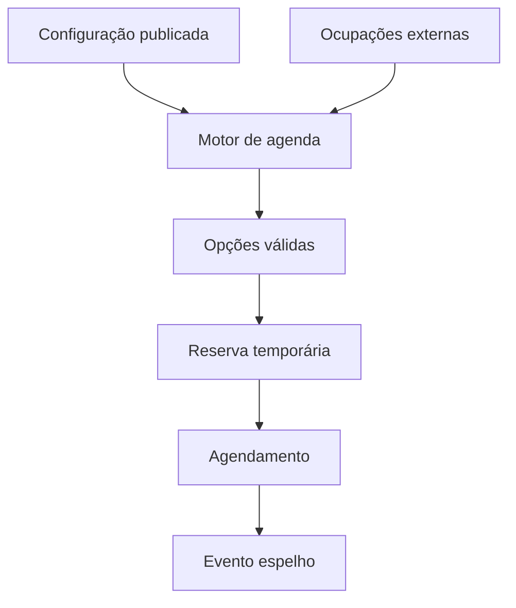
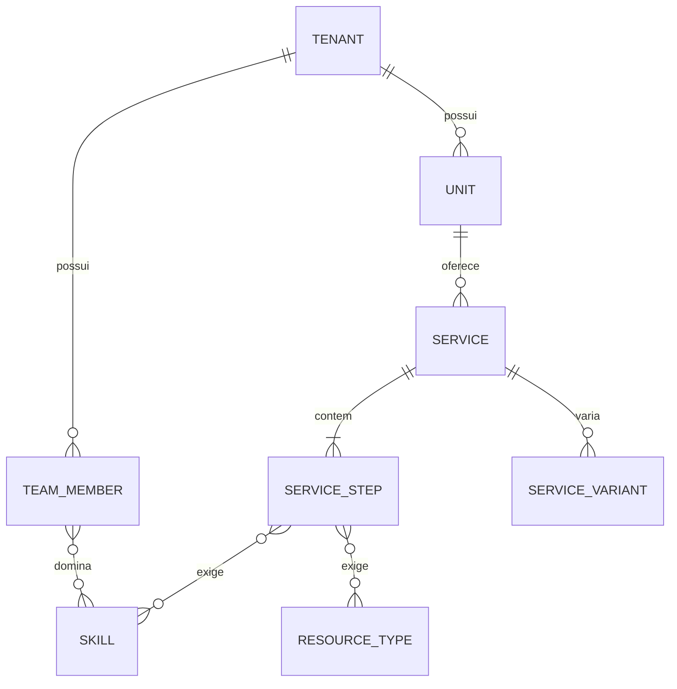
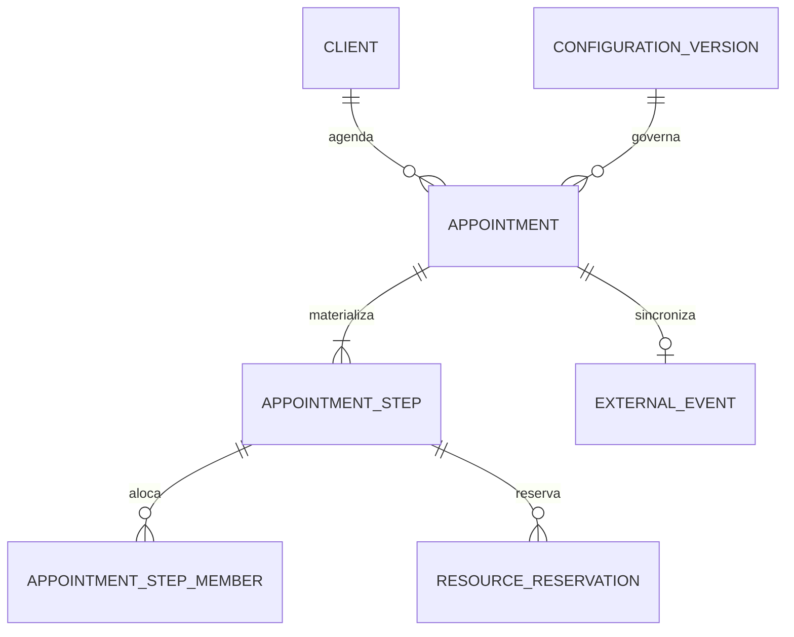

# Modelo de Domínio e Configurador — v1.0

**Produto:** SaaS multiempresa de agente de IA para negócios de beleza  
**Data:** 03 de agosto de 2026  
**Status:** aprovado pela fundadora e congelado como baseline; não autoriza implementação isoladamente  
**Aprovação:** 03 de agosto de 2026  
**Entradas canônicas:** `escopo-piloto-sem-sinal-v1.md` aprovado e `requisitos-piloto-v1.md` v1.1  
**Pilotos de referência:** Salão do William e Studio da Jack

## 1. Decisão central

William e Jack não geram ramificações no código. Eles são dois conjuntos de dados armazenados no mesmo modelo multiempresa.

O produto terá:

- um motor de agenda comum;
- um configurador comum;
- entidades comuns;
- validações comuns;
- dados, permissões e versões isolados por `tenant_id`.

É proibido implementar condições como `tenant.name === "William"`, `segment === "salão"` ou `service.name === "progressiva"` para alterar o cálculo. Segmento pode selecionar sugestões de onboarding, nunca regras ocultas.

## 2. Escopo desta modelagem

Este documento define o domínio lógico e os campos do configurador necessários para o piloto sem sinal:

- tenant, unidade, acesso e isolamento;
- equipe, habilidades, disponibilidade e turnos;
- expediente, bloqueios e exceções;
- recursos e capacidade;
- classificações configuráveis;
- serviços simples ou compostos, variações, etapas e preparos;
- prontidão, versionamento e publicação da configuração;
- simulação, cálculo, reserva e agendamento;
- Google Calendar espelho;
- WhatsApp restrito, conversa, mensagens e atendimento humano;
- auditoria, idempotência e métricas técnicas.

Continuam fora: pagamento, sinal, billing do SaaS, campanhas, CRM avançado, disparos em massa, aplicativo nativo e ações coletivas do agente do proprietário.

## 3. Linguagem do domínio

| Termo                  | Definição                                                                            |
| ---------------------- | ------------------------------------------------------------------------------------ |
| Tenant                 | Empresa cliente isolada dentro do SaaS.                                              |
| Unidade                | Local físico e fuso onde os serviços são realizados.                                 |
| Membro                 | Pessoa da equipe que pode trabalhar em etapas, como profissional ou assistente.      |
| Habilidade             | Capacidade operacional exigida por uma etapa.                                        |
| Recurso                | Capacidade física não humana, como cadeira, lavatório, maca ou equipamento.          |
| Serviço                | Item vendável solicitado pela cliente. Pode ser simples ou composto.                 |
| Etapa                  | Parte interna ordenada de um serviço; não é vendável isoladamente.                   |
| Variação               | Combinação configurada de características que altera preço, duração ou perguntas.    |
| Preparo                | Atendimento ou verificação vinculada que precisa ocorrer antes do serviço principal. |
| Configuração publicada | Versão imutável e validada usada pelo motor de agenda.                               |
| Candidato              | Possível horário de início ainda não oferecido à cliente.                            |
| Opção                  | Candidato integralmente validado e autorizado para apresentação.                     |
| Reserva temporária     | Proteção com expiração criada após a escolha de uma opção.                           |
| Agendamento            | Compromisso persistido com linha do tempo, pessoas e recursos definidos.             |
| Ocupação externa       | Evento importado do calendário que reduz disponibilidade.                            |

## 4. Contextos delimitados

| Contexto                 | Responsabilidade                                          | Não decide                        |
| ------------------------ | --------------------------------------------------------- | --------------------------------- |
| Identidade e tenancy     | Usuários, memberships, papéis, unidades e isolamento      | Disponibilidade                   |
| Configuração operacional | Cadastros, rascunho, validação, prontidão e publicação    | Intenção da conversa              |
| Catálogo e capacidade    | Serviços, etapas, variações, habilidades e recursos       | Horário final                     |
| Agenda                   | Geração de candidatos, alocação, reservas e agendamentos  | Texto enviado à cliente           |
| Integrações              | WhatsApp, Google, webhooks, sincronização e idempotência  | Regra operacional                 |
| Conversa                 | Estado, intenção estruturada, pergunta seguinte e handoff | Preço, duração ou disponibilidade |
| Evidência e operação     | Auditoria, métricas, erros e correlação                   | Regra de negócio                  |



## 5. Ciclo de configuração

Uma alteração administrativa não entra imediatamente no motor.

1. O administrador edita um rascunho.
2. O sistema recalcula os problemas de prontidão.
3. Enquanto houver erro bloqueante, o rascunho não pode ser publicado.
4. Ao publicar, o sistema cria uma versão imutável com snapshot e hash.
5. Novas buscas usam a versão publicada mais recente.
6. Opções, reservas e agendamentos preservam o `configuration_version_id` usado no cálculo.
7. Publicar uma nova versão invalida opções ainda não escolhidas; reservas temporárias precisam ser revalidadas antes da confirmação.
8. Agendamentos já confirmados não são alterados silenciosamente por uma nova configuração.

Estados da configuração:

```text
RASCUNHO_INCOMPLETO → RASCUNHO_VALIDO → PUBLICADA → SUBSTITUIDA
```

Uma versão publicada é somente leitura. Corrigir uma configuração cria nova versão.

## 6. Modelo lógico por domínio

### 6.1 Identidade, tenant e unidade

| Entidade               | Campos essenciais                                                                                   | Regras principais                                                                                    |
| ---------------------- | --------------------------------------------------------------------------------------------------- | ---------------------------------------------------------------------------------------------------- |
| `profiles`             | `id` igual ao usuário do Auth, `display_name`, `status`                                             | Identidade global; não contém permissão de tenant.                                                   |
| `tenants`              | `id`, `legal_name`, `display_name`, `slug`, `segment_hint`, `status`, `created_at`                  | `segment_hint` serve para sugestões de onboarding, não para lógica oculta.                           |
| `units`                | `id`, `tenant_id`, `name`, `timezone`, `address_json`, `active_configuration_version_id?`, `status` | Toda operação ocorre em uma unidade, usa o fuso dela e aponta para a configuração publicada vigente. |
| `tenant_memberships`   | `id`, `tenant_id`, `profile_id`, `role`, `status`                                                   | Fonte de autorização; nunca `user_metadata`.                                                         |
| `tenant_feature_flags` | `id`, `tenant_id`, `feature_key`, `enabled`, `effective_from`                                       | No piloto, `deposit_required=false`; não cria entidades de pagamento.                                |

Papéis iniciais: `OWNER`, `ADMIN`, `OPERATOR`, `VIEWER`. O cliente final do WhatsApp não possui membership.

### 6.2 Publicação, prontidão e histórico

| Entidade                 | Campos essenciais                                                                                                          | Regras principais                                                                                           |
| ------------------------ | -------------------------------------------------------------------------------------------------------------------------- | ----------------------------------------------------------------------------------------------------------- |
| `configuration_drafts`   | `id`, `tenant_id`, `unit_id`, `base_version_id?`, `revision`, `status`, `updated_by`, `updated_at`                         | Um rascunho ativo por unidade no piloto; `revision` protege contra edição concorrente.                      |
| `configuration_versions` | `id`, `tenant_id`, `unit_id`, `version_number`, `snapshot_json`, `snapshot_hash`, `published_by`, `published_at`, `status` | Imutável após publicação. O snapshot existe para reprodução e auditoria, não substitui o modelo relacional. |
| `configuration_checks`   | `id`, `tenant_id`, `draft_id`, `check_key`, `severity`, `entity_type`, `entity_id`, `message`, `resolved_at`               | `BLOCKING` impede publicação; `WARNING` exige ciência, mas pode permitir.                                   |

O snapshot publicado deve excluir segredos, tokens OAuth, mídia e dados pessoais de clientes.

Estratégia de leitura e edição:

- as tabelas relacionais de expediente, equipe, serviços, etapas, habilidades e recursos guardam o estado editável atual;
- qualquer alteração aumenta `configuration_drafts.revision` e marca o rascunho como diferente da versão base;
- a publicação valida a mesma revisão do início ao fim e compila os dados relacionais em um snapshot imutável;
- `units.active_configuration_version_id` aponta para a versão vigente;
- o motor de agenda lê somente o snapshot ativo, nunca as tabelas editáveis diretamente;
- o painel compara o estado relacional editável com o snapshot base para mostrar diferenças;
- depois da publicação, o snapshot novo vira a base do próximo rascunho, sem reescrever snapshots antigos.

Essa estratégia evita duplicar todas as linhas a cada versão e impede que uma edição incompleta altere cálculos em andamento.

### 6.3 Expediente e restrições da unidade

| Entidade                 | Campos essenciais                                                                                                                                                     | Regras principais                                                                                         |
| ------------------------ | --------------------------------------------------------------------------------------------------------------------------------------------------------------------- | --------------------------------------------------------------------------------------------------------- |
| `unit_operating_periods` | `id`, `tenant_id`, `unit_id`, `weekday`, `starts_at`, `ends_at`, `effective_from`, `effective_to`, `status`                                                           | Admite zero ou várias faixas por dia. Faixas da mesma unidade não podem se sobrepor.                      |
| `unit_service_limits`    | `id`, `tenant_id`, `unit_id`, `weekday`, `latest_end_time`, `effective_from`, `effective_to`                                                                          | Fechamento é término máximo, não último início.                                                           |
| `unit_blocks`            | `id`, `tenant_id`, `unit_id`, `kind`, `starts_at`, `ends_at`, `reason`, `status`                                                                                      | Feriado, manutenção, fechamento extraordinário ou indisponibilidade geral.                                |
| `schedule_exceptions`    | `id`, `tenant_id`, `unit_id`, `action`, `starts_at`, `ends_at`, `client_id?`, `service_id?`, `member_id?`, `reason`, `approval_status`, `approved_by?`, `expires_at?` | Quanto mais campos de escopo preenchidos, mais específica a regra. Exceção não altera o expediente geral. |

`action` inicial: `ALLOW_OUTSIDE_HOURS` ou `BLOCK`. Somente exceção `APPROVED` entra no cálculo.

### 6.4 Equipe, habilidades e disponibilidade

| Entidade                      | Campos essenciais                                                                                             | Regras principais                                                         |
| ----------------------------- | ------------------------------------------------------------------------------------------------------------- | ------------------------------------------------------------------------- |
| `team_members`                | `id`, `tenant_id`, `unit_id`, `display_name`, `member_type`, `availability_mode`, `status`                    | `member_type`: profissional ou assistente. O tipo não limita habilidades. |
| `skills`                      | `id`, `tenant_id`, `name`, `description`, `status`                                                            | Catálogo configurável por tenant.                                         |
| `member_skills`               | `id`, `tenant_id`, `member_id`, `skill_id`, `priority`, `effective_from`, `effective_to`                      | Define aptidão; prioridade ajuda a ordenar alocações.                     |
| `member_availability_periods` | `id`, `tenant_id`, `member_id`, `weekday`, `starts_at`, `ends_at`, `effective_from`, `effective_to`, `status` | Várias faixas semanais e turnos quebrados.                                |
| `member_shifts`               | `id`, `tenant_id`, `member_id`, `starts_at`, `ends_at`, `source`, `confirmation_status`, `external_event_id?` | Capacidade dinâmica só existe quando `CONFIRMED`.                         |
| `member_blocks`               | `id`, `tenant_id`, `member_id`, `kind`, `starts_at`, `ends_at`, `reason`, `status`                            | Almoço, folga, ausência ou bloqueio individual.                           |

Modos de disponibilidade:

- `FIXED`: usa faixas semanais e bloqueios.
- `DYNAMIC`: usa somente turnos confirmados.
- `HYBRID`: combina faixas semanais com turnos confirmados e exceções.

### 6.5 Recursos e capacidade

| Entidade          | Campos essenciais                                                                 | Regras principais                                                                                              |
| ----------------- | --------------------------------------------------------------------------------- | -------------------------------------------------------------------------------------------------------------- |
| `resource_types`  | `id`, `tenant_id`, `name`, `description`, `status`                                | Exemplos configuráveis: cadeira, lavatório, maca, cabine.                                                      |
| `resources`       | `id`, `tenant_id`, `unit_id`, `resource_type_id`, `name`, `capacity`, `status`    | `capacity` é inteiro positivo.                                                                                 |
| `resource_slots`  | `id`, `tenant_id`, `resource_id`, `slot_number`, `status`                         | Materializa a capacidade para impedir sobreposição por vaga. A interface mostra somente a capacidade agregada. |
| `resource_blocks` | `id`, `tenant_id`, `resource_slot_id`, `starts_at`, `ends_at`, `reason`, `status` | Manutenção ou indisponibilidade temporária.                                                                    |

Ao reduzir capacidade, slots já usados por agendamentos futuros não podem ser removidos; devem ser inativados somente após o último compromisso.

### 6.6 Classificações e perguntas

Este bloco é genérico para cabelo, cílios, unhas ou outro segmento.

| Entidade                     | Campos essenciais                                                                                                         | Regras principais                                                                        |
| ---------------------------- | ------------------------------------------------------------------------------------------------------------------------- | ---------------------------------------------------------------------------------------- |
| `classification_dimensions`  | `id`, `tenant_id`, `name`, `code`, `input_type`, `description`, `status`                                                  | Exemplos: comprimento, volume, textura, técnica, manutenção.                             |
| `classification_options`     | `id`, `tenant_id`, `dimension_id`, `label`, `description`, `sort_order`, `status`                                         | Exemplos de William: curto/médio/longo e pouco/médio/muito.                              |
| `classification_references`  | `id`, `tenant_id`, `option_id`, `media_asset_id?`, `caption`, `status`                                                    | Referência visual ou textual; não decide sozinha.                                        |
| `service_input_requirements` | `id`, `tenant_id`, `service_id`, `dimension_id`, `required_for`, `question_text`, `confirmation_threshold?`, `sort_order` | `required_for`: duração, preço ou agenda. Define o que realmente precisa ser perguntado. |

Uma classificação da IA é uma sugestão com confiança. O valor só pode afetar preço ou duração depois de atingir o limiar configurado ou ser confirmado pela cliente/humano.

### 6.7 Catálogo, variações e etapas

| Entidade                         | Campos essenciais                                                                                                        | Regras principais                                                                                                                                   |
| -------------------------------- | ------------------------------------------------------------------------------------------------------------------------ | --------------------------------------------------------------------------------------------------------------------------------------------------- |
| `services`                       | `id`, `tenant_id`, `unit_id`, `name`, `description`, `service_type`, `base_price?`, `currency`, `bookable`, `status`     | Serviço é a unidade vendável. Preço pode ser nulo no piloto se não for informado à cliente, mas duração nunca pode ficar irresolvida para publicar. |
| `service_variants`               | `id`, `tenant_id`, `service_id`, `name`, `price_amount?`, `status`                                                       | Representa uma combinação operacional explícita.                                                                                                    |
| `service_variant_values`         | `id`, `tenant_id`, `variant_id`, `dimension_id`, `option_id`                                                             | Uma opção por dimensão dentro da variante. Combinação deve ser única no serviço.                                                                    |
| `service_steps`                  | `id`, `tenant_id`, `service_id`, `name`, `sequence`, `base_duration_minutes`, `step_kind`, `customer_presence`, `status` | `step_kind`: `ACTIVE`, `PASSIVE` ou `WAITING`. Sequência única por serviço.                                                                         |
| `service_variant_step_overrides` | `id`, `tenant_id`, `variant_id`, `step_id`, `duration_minutes`                                                           | Permite que a variação altere etapas específicas sem a LLM calcular duração.                                                                        |
| `step_skill_requirements`        | `id`, `tenant_id`, `step_id`, `skill_id`, `quantity`, `assignment_policy`                                                | Define quantas pessoas aptas são necessárias e como escolher.                                                                                       |
| `step_resource_requirements`     | `id`, `tenant_id`, `step_id`, `resource_type_id`, `quantity`, `occupancy_mode`                                           | `occupancy_mode` inicial é `FULL_STEP`; necessidades de início/fim devem ser modeladas como etapas próprias.                                        |
| `service_step_dependencies`      | `id`, `tenant_id`, `step_id`, `depends_on_step_id`, `dependency_type`, `lag_minutes`                                     | Piloto usa `FINISH_TO_START`; estrutura admite evolução sem quebrar o domínio.                                                                      |

Política de alocação inicial: `PREFERRED_THEN_ANY_QUALIFIED`. A ordem vem de `member_skills.priority`; nomes de pessoas não entram na regra.

### 6.8 Preparos vinculados

| Entidade                       | Campos essenciais                                                                                                                            | Regras principais                                                          |
| ------------------------------ | -------------------------------------------------------------------------------------------------------------------------------------------- | -------------------------------------------------------------------------- |
| `preparation_rules`            | `id`, `tenant_id`, `service_id`, `name`, `required_mode`, `min_lead_minutes`, `max_lead_minutes?`, `status`                                  | `required_mode`: sempre, condicional ou recomendado.                       |
| `preparation_allowed_weekdays` | `id`, `tenant_id`, `preparation_rule_id`, `weekday`                                                                                          | Permite terça a sexta, por exemplo, sem texto no código.                   |
| `preparation_conditions`       | `id`, `tenant_id`, `preparation_rule_id`, `dimension_id`, `option_id`, `operator`                                                            | Define quando o preparo é exigido ou sugerido.                             |
| `preparation_steps`            | Mesma estrutura conceitual de etapa: ordem, duração, habilidades e recursos                                                                  | Pode ser implementada como serviço interno não vendável vinculado à regra. |
| `client_preparations`          | `id`, `tenant_id`, `client_id`, `service_id`, `preparation_rule_id`, `appointment_id?`, `status`, `performed_at?`, `valid_until?`, `result?` | O serviço principal só confirma se o preparo obrigatório estiver válido.   |

O “teste de mechas de uma hora que não impacta a produção” não pode ser armazenado como um único bloqueio cego de 60 minutos. O configurador deve decompor tempo ativo, espera e recursos ocupados usando etapas, exatamente como qualquer serviço composto.

### 6.9 Clientes, consentimentos e mídia mínima

| Entidade                  | Campos essenciais                                                                                                    | Regras principais                                                  |
| ------------------------- | -------------------------------------------------------------------------------------------------------------------- | ------------------------------------------------------------------ |
| `clients`                 | `id`, `tenant_id`, `display_name?`, `status`, `created_at`                                                           | Cadastro progressivo; nome pode estar ausente no primeiro contato. |
| `client_contacts`         | `id`, `tenant_id`, `client_id`, `channel`, `normalized_value`, `is_primary`, `verified_at?`                          | Telefone normalizado é único por tenant e canal.                   |
| `client_attribute_values` | `id`, `tenant_id`, `client_id`, `dimension_id`, `option_id?`, `raw_value?`, `source`, `confidence?`, `confirmed_at?` | Preserva origem e confirmação; não transforma inferência em fato.  |
| `consents`                | `id`, `tenant_id`, `client_id`, `purpose`, `status`, `source`, `captured_at`, `revoked_at?`                          | Separar atendimento de comunicação promocional futura.             |
| `media_assets`            | `id`, `tenant_id`, `owner_type`, `owner_id`, `storage_key`, `media_type`, `retention_until`, `status`                | Bucket privado; sem URL pública permanente.                        |

Histórico comercial avançado e segmentação não entram no piloto.

### 6.10 Busca de agenda, opções e reserva

| Entidade                     | Campos essenciais                                                                                                                                             | Regras principais                                                                                                                             |
| ---------------------------- | ------------------------------------------------------------------------------------------------------------------------------------------------------------- | --------------------------------------------------------------------------------------------------------------------------------------------- |
| `availability_searches`      | `id`, `tenant_id`, `unit_id`, `client_id?`, `service_id`, `variant_id?`, `configuration_version_id`, `window_start`, `window_end`, `status`, `correlation_id` | Entrada auditável do motor.                                                                                                                   |
| `availability_candidates`    | `id`, `tenant_id`, `search_id`, `starts_at`, `ends_at`, `result`, `rejection_codes[]`, `rank`                                                                 | Guarda aceitação/rejeição e razões; não precisa persistir todos indefinidamente.                                                              |
| `availability_option_steps`  | `id`, `tenant_id`, `candidate_id`, `service_step_id`, `starts_at`, `ends_at`, `member_ids[]`, `resource_slot_ids[]`                                           | Plano materializado entregue somente se o candidato for válido. Arrays no artefato lógico podem virar tabelas de associação na implementação. |
| `schedule_holds`             | `id`, `tenant_id`, `candidate_id`, `client_id`, `status`, `expires_at`, `configuration_version_id`, `created_at`                                              | `ACTIVE`, `EXPIRED`, `CONVERTED` ou `RELEASED`. Deve bloquear pessoas e slots.                                                                |
| `hold_steps`                 | `id`, `tenant_id`, `hold_id`, `source_step_id`, `starts_at`, `ends_at`                                                                                        | Copia a linha do tempo escolhida para que ela não dependa do candidato transitório.                                                           |
| `hold_step_members`          | `id`, `tenant_id`, `hold_step_id`, `member_id`, `starts_at`, `ends_at`, `status`                                                                              | Protege a ocupação humana durante a validade da reserva.                                                                                      |
| `hold_resource_reservations` | `id`, `tenant_id`, `hold_step_id`, `resource_slot_id`, `starts_at`, `ends_at`, `status`                                                                       | Protege a vaga física durante a validade da reserva.                                                                                          |

No banco físico, profissionais e slots de cada opção serão normalizados para permitir restrições de concorrência; os arrays do candidato descrevem apenas o agregado de avaliação. Ao criar o hold, as ocupações são persistidas nas três tabelas próprias acima.

### 6.11 Agendamento

| Entidade                   | Campos essenciais                                                                                                                                                              | Regras principais                                            |
| -------------------------- | ------------------------------------------------------------------------------------------------------------------------------------------------------------------------------ | ------------------------------------------------------------ |
| `appointments`             | `id`, `tenant_id`, `unit_id`, `client_id`, `service_id`, `variant_id?`, `configuration_version_id`, `status`, `starts_at`, `ends_at`, `source`, `correlation_id`, `created_at` | Não contém estado de pagamento no piloto.                    |
| `appointment_steps`        | `id`, `tenant_id`, `appointment_id`, `source_step_id`, `name_snapshot`, `sequence`, `starts_at`, `ends_at`, `status`                                                           | Snapshot evita que edição futura apague o que foi combinado. |
| `appointment_step_members` | `id`, `tenant_id`, `appointment_step_id`, `member_id`, `skill_id`, `starts_at`, `ends_at`                                                                                      | Intervalo exato de ocupação humana.                          |
| `resource_reservations`    | `id`, `tenant_id`, `appointment_step_id`, `resource_slot_id`, `starts_at`, `ends_at`, `status`                                                                                 | Restrição de não sobreposição por slot.                      |
| `appointment_events`       | `id`, `tenant_id`, `appointment_id`, `event_type`, `payload_minimized`, `actor_type`, `actor_id?`, `occurred_at`                                                               | Histórico de confirmação, cancelamento, remarcação e falha.  |

Estados iniciais:

```text
SOLICITACAO | COLETA_DE_DADOS | BUSCA_DE_HORARIOS | HORARIO_PROPOSTO
RESERVA_TEMPORARIA | CONFIRMADO | SINCRONIZACAO_PENDENTE | SINCRONIZADO
EXPIRADO | CANCELADO | REAGENDAMENTO_PENDENTE | FALHA_DE_INTEGRACAO | ATENDIMENTO_HUMANO
```

Uma remarcação cria novo cálculo e nova reserva; o horário anterior só é liberado na transação que confirma o novo.

### 6.12 Google Calendar espelho

| Entidade                 | Campos essenciais                                                                                                                              | Regras principais                                                                 |
| ------------------------ | ---------------------------------------------------------------------------------------------------------------------------------------------- | --------------------------------------------------------------------------------- |
| `calendar_connections`   | `id`, `tenant_id`, `provider`, `account_label`, `credential_ref`, `status`, `last_verified_at`                                                 | Token fica criptografado fora das tabelas expostas.                               |
| `calendar_mappings`      | `id`, `tenant_id`, `unit_id`, `connection_id`, `external_calendar_id`, `mapping_scope`, `member_id?`, `resource_id?`, `status`                 | Piloto usa um mapeamento principal por tenant; o domínio admite vários no futuro. |
| `external_events`        | `id`, `tenant_id`, `mapping_id`, `external_event_id`, `etag`, `starts_at`, `ends_at`, `busy`, `origin`, `status`, `last_seen_at`               | Chave externa única por conexão; não duplica ao reprocessar.                      |
| `calendar_sync_states`   | `id`, `tenant_id`, `mapping_id`, `sync_token_ref?`, `channel_expiration?`, `last_full_sync_at?`, `last_incremental_sync_at?`, `status`         | Token/cursor e saúde de sincronização.                                            |
| `integration_operations` | `id`, `tenant_id`, `provider`, `operation`, `idempotency_key`, `aggregate_type`, `aggregate_id`, `status`, `attempt_count`, `next_attempt_at?` | Criação, atualização, cancelamento e reconciliação com repetição segura.          |

Regra segura para o calendário único: evento externo não correlacionado bloqueia a unidade inteira no intervalo. O painel poderá classificar o evento como pertencente a um membro ou recurso específico; até essa classificação, o motor não presume capacidade disponível.

### 6.13 WhatsApp, conversa e atendimento humano

| Entidade                 | Campos essenciais                                                                                                                              | Regras principais                                                               |
| ------------------------ | ---------------------------------------------------------------------------------------------------------------------------------------------- | ------------------------------------------------------------------------------- |
| `channel_connections`    | `id`, `tenant_id`, `channel`, `external_account_id`, `credential_ref`, `mode`, `status`                                                        | `mode=RESTRICTED` no piloto.                                                    |
| `channel_allowlist`      | `id`, `tenant_id`, `connection_id`, `normalized_contact`, `status`, `expires_at?`                                                              | Contém somente o número autorizado durante testes.                              |
| `conversations`          | `id`, `tenant_id`, `client_id`, `channel_connection_id`, `state`, `paused`, `human_mode`, `last_message_at`, `correlation_id`                  | Uma máquina de estados controla o fluxo; a LLM não escolhe estados livremente.  |
| `messages`               | `id`, `tenant_id`, `conversation_id`, `external_message_id`, `direction`, `message_type`, `content_ref?`, `status`, `sent_at?`, `received_at?` | ID externo único; conteúdo sensível não deve ser duplicado em logs.             |
| `message_transcriptions` | `id`, `tenant_id`, `message_id`, `text`, `language?`, `confidence?`, `status`                                                                  | Áudio é processado internamente; o agente não ecoa a transcrição.               |
| `conversation_facts`     | `id`, `tenant_id`, `conversation_id`, `fact_key`, `value_json`, `source_message_id`, `confidence?`, `confirmed_at?`                            | Saída estruturada validada; fatos críticos sem confirmação não entram no motor. |
| `human_handoffs`         | `id`, `tenant_id`, `conversation_id`, `reason`, `status`, `assigned_to?`, `opened_at`, `closed_at?`                                            | Casos ambíguos ou falhas seguras.                                               |
| `message_templates`      | `id`, `tenant_id`, `template_type`, `name`, `body`, `variables_schema`, `status`                                                               | Mensagem final usa apenas variáveis validadas.                                  |

### 6.14 Inbox, outbox, auditoria e métricas

| Entidade                | Campos essenciais                                                                                                                                                               | Regras principais                                               |
| ----------------------- | ------------------------------------------------------------------------------------------------------------------------------------------------------------------------------- | --------------------------------------------------------------- |
| `inbox_events`          | `id`, `tenant_id`, `provider`, `external_event_id`, `event_type`, `payload_ref`, `status`, `received_at`, `processed_at?`                                                       | Restrição única por provedor + conta + ID externo.              |
| `outbox_events`         | `id`, `tenant_id`, `aggregate_type`, `aggregate_id`, `event_type`, `payload_minimized`, `status`, `available_at`, `attempt_count`                                               | Gravado na mesma transação do fato de negócio.                  |
| `idempotency_keys`      | `id`, `tenant_id`, `scope`, `key`, `request_hash`, `result_ref?`, `expires_at`                                                                                                  | Mesma chave e mesmo conteúdo retornam o mesmo resultado lógico. |
| `audit_logs`            | `id`, `tenant_id`, `actor_type`, `actor_id?`, `action`, `entity_type`, `entity_id`, `configuration_version_id?`, `correlation_id`, `result`, `metadata_minimized`, `created_at` | Append-only; sem segredo, token ou mídia bruta.                 |
| `product_events`        | `id`, `tenant_id`, `event_name`, `aggregate_type`, `aggregate_id`, `properties_minimized`, `occurred_at`                                                                        | Métricas do piloto, nunca texto completo de conversa.           |
| `integration_incidents` | `id`, `tenant_id`, `provider`, `severity`, `correlation_id`, `status`, `summary`, `opened_at`, `resolved_at?`                                                                   | Diagnóstico e tratamento de falhas.                             |

## 7. Relações essenciais





## 8. Invariantes que o banco e o motor devem proteger

1. Todo registro operacional possui `tenant_id NOT NULL`.
2. Relações entre entidades devem pertencer ao mesmo tenant; IDs de tenants diferentes nunca podem ser associados.
3. Uma unidade sempre possui fuso IANA válido.
4. Intervalos usam timestamps com fuso no banco; horas semanais são interpretadas no fuso da unidade.
5. `starts_at < ends_at` para todo intervalo.
6. Durações são inteiros positivos; espera real de zero minuto deve ser omitida, não cadastrada como etapa vazia.
7. Serviço publicado tem ao menos uma etapa ativa e duração resolvível para toda combinação publicável.
8. Cada etapa que exige pessoa possui habilidade e ao menos um membro ativo apto na janela analisada.
9. Cada recurso exigido possui capacidade suficiente e slots ativos.
10. Apenas configuração publicada participa da busca real.
11. Candidato rejeitado nunca pode virar opção ou reserva.
12. Reserva expirada nunca pode ser confirmada.
13. A confirmação revalida configuração, ocupações, pessoas, recursos e expiração dentro da transação.
14. Um membro ou slot não pode ter ocupações confirmadas sobrepostas.
15. Um evento externo desconhecido e marcado como ocupado bloqueia de forma conservadora.
16. Falha de Google, WhatsApp ou LLM nunca produz confirmação falsa.
17. Inativação preserva histórico; exclusão física só ocorre em cadastro sem dependências e com confirmação.
18. Uma nova configuração não reescreve agendamentos existentes.
19. A conversão de hold em agendamento cria as ocupações definitivas e encerra as ocupações temporárias na mesma transação.

## 9. Precedência das regras

Quando duas regras afetarem o mesmo candidato, aplicar nesta ordem e registrar a origem:

1. segurança, privacidade, indisponibilidade real ou configuração inválida;
2. bloqueio confirmado de pessoa, recurso ou calendário;
3. regra individual da cliente;
4. exceção aprovada para data/agendamento;
5. regra do serviço, etapa ou preparo;
6. regra do período;
7. regra geral da unidade.

Uma permissão de menor prioridade não pode liberar algo bloqueado por prioridade maior. Conflito sem resolução determinística bloqueia confirmação automática.

## 10. Checklist calculado de prontidão

| Código                         | Validação bloqueante                                            |
| ------------------------------ | --------------------------------------------------------------- |
| `UNIT_TIMEZONE_MISSING`        | Unidade sem fuso válido.                                        |
| `OPERATING_HOURS_MISSING`      | Nenhuma faixa de funcionamento publicada.                       |
| `LATEST_END_MISSING`           | Dia atendido sem término máximo.                                |
| `NO_ACTIVE_MEMBER`             | Nenhum membro operacional ativo.                                |
| `MEMBER_AVAILABILITY_INVALID`  | Membro necessário sem faixa ou turno válido.                    |
| `SERVICE_HAS_NO_STEPS`         | Serviço vendável sem etapas.                                    |
| `STEP_DURATION_UNRESOLVED`     | Etapa sem duração para uma variação publicável.                 |
| `STEP_HAS_NO_QUALIFIED_MEMBER` | Etapa ativa sem pessoa apta.                                    |
| `RESOURCE_CAPACITY_MISSING`    | Recurso obrigatório sem slot disponível.                        |
| `PREPARATION_RULE_INCOMPLETE`  | Preparo obrigatório sem janela, duração ou capacidade.          |
| `CALENDAR_NOT_HEALTHY`         | Calendário espelho sem sincronização válida.                    |
| `DEPOSIT_FLAG_NOT_EXPLICIT`    | Política do piloto não definida explicitamente como desativada. |
| `FINAL_MESSAGE_MISSING`        | Template de confirmação ausente ou inválido.                    |
| `RESTRICTED_CHANNEL_INVALID`   | Canal fora do modo restrito ou allowlist divergente.            |

Warnings não bloqueantes devem ser separados, por exemplo: preço não informado, referência visual ausente ou membro sem telefone.

## 11. Campos do configurador

### 11.1 Negócio e unidade

| Seção          | Campos editáveis                                                                              | Ações e validações                                                               |
| -------------- | --------------------------------------------------------------------------------------------- | -------------------------------------------------------------------------------- |
| Empresa        | nome de exibição, nome legal opcional, segmento sugerido, status                              | Criar, editar, inativar; segmento só muda sugestões.                             |
| Unidade        | nome, fuso, endereço, status                                                                  | Fuso obrigatório antes de horários.                                              |
| Funcionamento  | dia, início, fim, vigência                                                                    | Adicionar várias faixas, ordenar, excluir sem dependência, impedir sobreposição. |
| Término máximo | dia, hora limite                                                                              | Mostrar claramente “todo atendimento deve terminar até”.                         |
| Bloqueios      | tipo, início, fim, motivo                                                                     | Criar, editar, cancelar e visualizar no calendário.                              |
| Exceções       | ação, data/intervalo, cliente opcional, serviço opcional, membro opcional, motivo e aprovação | Exibir escopo e precedência; exceção pendente não afeta o motor.                 |

### 11.2 Equipe

| Seção              | Campos editáveis                                     | Ações e validações                                                  |
| ------------------ | ---------------------------------------------------- | ------------------------------------------------------------------- |
| Membro             | nome, tipo, unidade, modo de disponibilidade, status | Criar, editar, inativar, reativar e excluir se sem histórico.       |
| Habilidades        | habilidade, prioridade, vigência                     | Uma pessoa pode ter várias; assistente pode executar etapa se apta. |
| Faixas semanais    | dia, início, fim, vigência                           | Várias faixas e turnos quebrados; impedir sobreposição.             |
| Turno dinâmico     | data, início, fim, origem, status de confirmação     | Só `CONFIRMED` gera capacidade.                                     |
| Bloqueios pessoais | almoço, folga, ausência, início, fim, motivo         | Visualizar junto às ocupações.                                      |

### 11.3 Recursos

| Seção             | Campos editáveis                        | Ações e validações                                                         |
| ----------------- | --------------------------------------- | -------------------------------------------------------------------------- |
| Tipo              | nome e descrição                        | Reutilizável entre serviços do tenant.                                     |
| Recurso           | nome, unidade, tipo, capacidade, status | Capacidade maior que zero; impedir redução incompatível com agenda futura. |
| Indisponibilidade | vaga/recurso, início, fim, motivo       | Bloquear manutenção ou indisponibilidade.                                  |

### 11.4 Classificações

| Seção      | Campos editáveis                          | Ações e validações                                          |
| ---------- | ----------------------------------------- | ----------------------------------------------------------- |
| Dimensão   | nome, código, tipo de entrada e descrição | Ex.: comprimento, volume, técnica ou manutenção.            |
| Opção      | rótulo, descrição operacional e ordem     | Ex.: curto/médio/longo.                                     |
| Referência | imagem privada e legenda                  | Servir de apoio; nunca substituir confirmação crítica.      |
| Pergunta   | texto, serviço, dimensão, motivo e ordem  | Perguntar somente quando bloquear duração, preço ou agenda. |
| Confiança  | limiar de confirmação                     | Abaixo do limiar, perguntar ou transferir para humano.      |

### 11.5 Serviços

| Seção                | Campos editáveis                                                             | Ações e validações                                     |
| -------------------- | ---------------------------------------------------------------------------- | ------------------------------------------------------ |
| Serviço              | nome, descrição, unidade, tipo, preço base opcional, moeda, vendável, status | Não publicar se duração não for resolvível.            |
| Variações            | nome, opções de classificação, preço opcional                                | Gerar combinações selecionadas e detectar duplicidade. |
| Etapas               | nome, ordem, duração base, tipo, presença da cliente                         | Arrastar/ordenar; mudança deve recalcular total.       |
| Duração por variação | variante, etapa, minutos                                                     | Mostrar total resultante e combinações sem duração.    |
| Pessoas por etapa    | habilidade, quantidade, política de escolha                                  | Listar membros atualmente aptos como prévia.           |
| Recursos por etapa   | tipo, quantidade e ocupação                                                  | Validar capacidade atual da unidade.                   |
| Dependências         | etapa anterior, tipo, intervalo                                              | Piloto restringe a sequência término→início.           |

### 11.6 Preparos

| Seção             | Campos editáveis                                             | Ações e validações                                             |
| ----------------- | ------------------------------------------------------------ | -------------------------------------------------------------- |
| Regra             | serviço principal, nome, obrigatório/condicional/recomendado | Nunca cadastrar como observação solta.                         |
| Janela            | antecedência mínima/máxima e dias permitidos                 | Validar se existe janela possível.                             |
| Condições         | dimensão e opção que ativam a regra                          | Condição precisa ser determinística.                           |
| Etapas do preparo | etapas, duração, pessoas e recursos                          | Mesma capacidade de modelagem de um serviço composto.          |
| Validade          | prazo de validade do resultado                               | Impedir confirmação do principal quando obrigatório e vencido. |

### 11.7 Integrações e mensagens

| Seção            | Campos editáveis                                      | Ações e validações                                                           |
| ---------------- | ----------------------------------------------------- | ---------------------------------------------------------------------------- |
| Google           | conta, calendário espelho, escopo do mapeamento       | Conectar, testar, sincronizar, desconectar com confirmação.                  |
| Eventos externos | intervalo, título minimizado, classificação de escopo | Desconhecido bloqueia unidade; administrador pode atribuir a membro/recurso. |
| WhatsApp         | conta, modo e status                                  | Piloto bloqueado em `RESTRICTED`.                                            |
| Allowlist        | número normalizado e validade opcional                | Somente o número da Duda nos testes iniciais.                                |
| Mensagem final   | corpo e variáveis permitidas                          | Prévia obrigatória; rejeitar variável não validada.                          |
| Handoff          | motivos e instrução segura                            | Definir quando parar automação e chamar humano.                              |

### 11.8 Publicação e simulador

| Seção      | Conteúdo                                                  | Ações e evidências                                                 |
| ---------- | --------------------------------------------------------- | ------------------------------------------------------------------ |
| Prontidão  | erros bloqueantes e warnings agrupados por módulo         | Abrir diretamente o cadastro que resolve cada erro.                |
| Diferenças | alterações entre versão publicada e rascunho              | Revisar impacto antes de publicar.                                 |
| Publicação | número, autor, data, resumo e hash                        | Exigir confirmação; versão publicada fica imutável.                |
| Simulador  | cliente, serviço, variação, período e dados classificados | Usar o mesmo motor de produção; não gravar agenda real.            |
| Resultado  | opções, linha do tempo, pessoas, recursos e rejeições     | Mostrar razões determinísticas, não explicação inventada pela LLM. |

## 12. Exemplo de William como dados

O exemplo abaixo prova expressividade do modelo; não é seed definitivo nem regra especial.

| Necessidade real                     | Configuração genérica correspondente                                                  |
| ------------------------------------ | ------------------------------------------------------------------------------------- |
| Progressiva sem formol               | Um registro em `services`.                                                            |
| Lavagem 20 min                       | Etapa 1 com habilidade e recurso configurados.                                        |
| Pausa 60 min                         | Etapa 2 passiva, sem ocupação humana contínua e com recursos explicitamente mantidos. |
| Escova 25 min                        | Etapa 3 ativa.                                                                        |
| Chapinha 90 min                      | Etapa 4 ativa.                                                                        |
| Assistente fixa                      | Membro com modo `FIXED` ou `HYBRID` e faixas semanais.                                |
| Assistente ocasional                 | Membro `DYNAMIC` com `member_shifts` confirmados.                                     |
| Sábado às 07h para caso aprovado     | `schedule_exception` específica `ALLOW_OUTSIDE_HOURS`.                                |
| Término de todos os serviços até 19h | `unit_service_limits.latest_end_time=19:00`.                                          |
| Teste de mechas                      | `preparation_rule` com dias permitidos e etapas próprias.                             |
| Curto/médio/longo                    | Opções da dimensão configurável “comprimento”.                                        |
| Pouco/médio/muito                    | Opções da dimensão configurável “volume”.                                             |
| Sem sinal                            | Feature/política explicitamente desativada.                                           |

A divergência histórica do expediente do William continua sendo dado pendente do tenant, não lacuna do modelo.

## 13. Prova de generalização com Jack

O mesmo modelo representa:

- Jack e duas manicures como `team_members` independentes;
- cílios e unhas como serviços diferentes;
- duração simples ou etapas compostas conforme cada procedimento;
- maca, mesa, cabine ou equipamento como recursos configuráveis;
- habilidades diferentes por profissional;
- expediente e folgas próprios;
- uma única agenda Google espelho sem fundir a capacidade interna das três pessoas;
- sinal desativado sem remover a capacidade futura do produto.

Os valores operacionais definitivos da Jack serão cadastrados no configurador; não são necessários para criar outra estrutura de banco.

## 14. Requisitos de banco para a implementação futura

Estas são decisões lógicas; índices, SQL, políticas RLS e migrations pertencem à etapa de Backend após aprovação deste documento.

- UUIDs como identificadores.
- `tenant_id` redundante também nas tabelas associativas para RLS e validação de integridade.
- Chaves compostas ou constraints que impeçam relações cruzadas entre tenants.
- `created_at`, `updated_at`, `created_by` e `updated_by` nas entidades administrativas mutáveis.
- Estados explícitos em vez de exclusão silenciosa.
- `tstzrange`/intervalos equivalentes para ocupações reais.
- proteção de sobreposição para membros e `resource_slots` em reservas/compromissos ativos;
- transação e bloqueio para conversão de hold em agendamento;
- RLS em toda tabela exposta e acesso por membership;
- views expostas com comportamento de invocador;
- segredos apenas por referência e fora do frontend;
- payload bruto de integração fora de logs comuns e com retenção própria;
- migrations reversíveis e dados de seed apenas para teste.

## 15. Matriz de rastreabilidade

| Grupo do modelo                | Requisitos de origem                                           |
| ------------------------------ | -------------------------------------------------------------- |
| Tenant e membership            | RF-TEN-001 a RF-TEN-007; RNF-SEG-001/002                       |
| Prontidão e versões            | RF-CFG-004 a RF-CFG-007; RF-AUD-002; CA-001                    |
| Expediente e exceções          | RF-CFG-001 a RF-CFG-003; RF-AGE-003; RN-002                    |
| Equipe e disponibilidade       | RF-EQP-001 a RF-EQP-008; RN-005/006                            |
| Serviços, variações e preparos | RF-SRV-001 a RF-SRV-012; RN-003/004                            |
| Recursos                       | RF-REC-001 a RF-REC-004; CA-003                                |
| Busca, hold e agenda           | RF-AGE-001 a RF-AGE-012; RF-AGD-001 a RF-AGD-006; CA-002/004   |
| Simulador                      | RF-SIM-001 a RF-SIM-004                                        |
| Google Calendar                | RF-GCA-001 a RF-GCA-007; CA-005                                |
| Conversa e WhatsApp            | RF-CON-001 a RF-CON-009; RF-WHA-001 a RF-WHA-006               |
| Auditoria e idempotência       | RF-AUD-001 a RF-AUD-004; RNF-IDM-001; RNF-AUD-001; RNF-OBS-001 |

## 16. Decisões adiadas conscientemente

- Estrutura física exata, índices, enums e políticas SQL.
- Contratos de API e eventos.
- Algoritmo de busca e ranking de opções.
- Provedor e armazenamento de segredos.
- Prazo de retenção de mensagem, áudio, mídia e auditoria.
- Metas de latência e disponibilidade.
- Sinal, pagamento e estados financeiros.
- CRM, promoções, campanhas e agente do proprietário.

Esses itens pertencem a artefatos posteriores ou dependem de medição. Adiá-los aqui não autoriza improviso na implementação.

## 17. Critérios de aceite deste modelo

O modelo será aceito quando:

1. William e Jack puderem ser representados apenas por dados configuráveis.
2. A progressiva e o teste de mechas puderem ser decompostos sem virar regras pelo nome.
3. Profissional fixo, híbrido e dinâmico puderem ser calculados pelo mesmo mecanismo.
4. Uma única agenda externa não eliminar a capacidade interna por pessoa e recurso.
5. Mudanças administrativas só afetarem novos cálculos após validação e publicação.
6. Toda confirmação preservar versão, etapas, alocações e recursos usados.
7. Conflitos de tenant, pessoa e recurso puderem ser impedidos também no banco.
8. O configurador mostrar todos os campos indispensáveis e os erros de prontidão.
9. Nenhuma entidade ou fluxo de pagamento for dependência do piloto.

## 18. Pergunta que bloqueia o próximo passo

Você aprova este modelo — incluindo rascunho/publicação versionada, capacidade por vagas de recurso e bloqueio conservador de evento externo não classificado — como base para o próximo artefato `arquitetura-tecnica-piloto-v1.md`?
