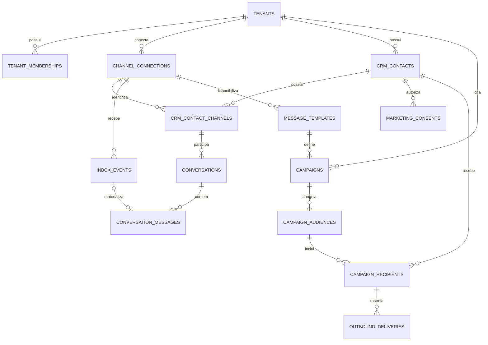
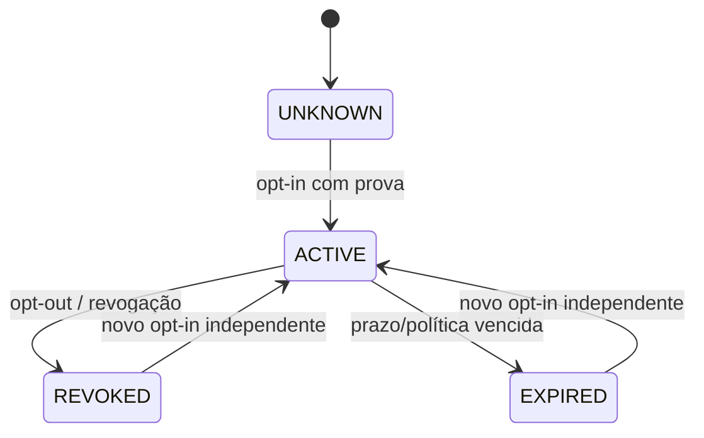
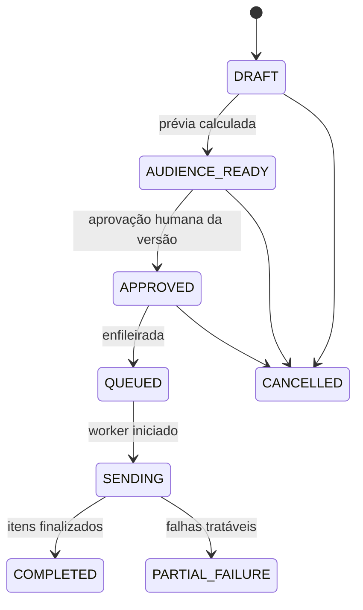

# Modelo de domínio — CRM, Inbox e campanhas por tenant

**Artefato:** modelagem de domínio e banco de dados  
**Entrada:** escopo rebaselined e requisitos aprovados para inbox primeiro e campanha real controlada  
**Estado:** documentado. Nenhuma nova tabela, migração, RLS, worker ou envio foi implementado por este artefato.

> **Decisão estrutural:** William não é uma entidade de produto. É apenas o primeiro registro de `tenant`. Todo dado de CRM, WhatsApp, campanha e auditoria pertence ao `tenant_id` resolvido no servidor.

## 1. Modelo lógico

## 2. Entidades existentes que serão preservadas

| Entidade existente | Papel no novo modelo | Alteração proposta |
|---|---|---|
| `app.tenants` | Fronteira de isolamento empresarial. | Nenhuma alteração estrutural. Todos os novos registros recebem `tenant_id`. |
| `app.tenant_memberships` | Identidade e autorização de OWNER/ADMIN/OPERATOR/VIEWER. | Adicionar matriz de permissões no backend; não confiar na UI. |
| `app.channel_connections` | Vincula WABA/número oficial a um tenant. | Reusar como origem da inbox, de templates e de envios. Não armazenar token. |
| `app.channel_allowlist` | Proteção atual do piloto restrito. | Manter como gate temporário de ingestão e primeiro envio controlado; não confundir com consentimento de marketing. |
| `app.inbox_events` | Caixa de entrada técnica, idempotente e minimizada. | Manter como raw/durable event log; não expor diretamente como interface de conversa. |
| `app.appointments` | Agenda já implementada, hoje com `customer_label` e `external_contact_ref` opacos. | Acrescentar referência opcional a `crm_contact_id` via migração compatível, sem apagar dados históricos. |
| `app.audit_logs` | Registro append-only multiempresa. | Reusar para ações de campanha, consentimento, envio, cancelamento e falha. |

## 3. Novas entidades propostas

| Entidade | Chave e relações | Finalidade | Dados pessoais e retenção |
|---|---|---|---|
| `app.crm_contacts` | `id`; `tenant_id → tenants`; opcional `primary_unit_id → units` | Perfil mínimo do cliente do negócio, separado do payload bruto do webhook. | Nome exibido e campos mínimos. Sem histórico integral duplicado. Política de retenção pendente de decisão. |
| `app.crm_contact_channels` | `id`; `tenant_id`; `contact_id`; `connection_id`; `channel`; `normalized_address` | Identificador por canal (WhatsApp) e ponto único para unicidade de telefone dentro da conexão. | Número normalizado. Valor cifrado/pseudonimizado em exibições e logs quando possível. |
| `app.conversations` | `id`; `tenant_id`; `connection_id`; `contact_channel_id`; `last_message_at` | Agregado de uma conversa por cliente/canal. | Não guarda payload completo duplicado. |
| `app.conversation_messages` | `id`; `tenant_id`; `conversation_id`; `inbox_event_id?`; `provider_message_id`; direção e estado | Projeção legível da inbox técnica para UI operacional. | Conteúdo apenas se autorizado; metadados suficientes para status quando não houver autorização. |
| `app.marketing_consents` | `id`; `tenant_id`; `contact_id`; `connection_id?`; `purpose`; `status`; `captured_at`; `revoked_at` | Fonte de verdade de consentimento de campanha por pessoa, canal e finalidade. | Armazena prova mínima: fonte, texto/versão, data e ator. |
| `app.message_templates` | `id`; `tenant_id`; `connection_id`; `provider_template_id`; `name`; `language`; `status`; `category` | Catálogo espelhado de templates disponíveis para o número do tenant. | Sem credenciais; versão/conteúdo aprovado da Meta quando necessário. |
| `app.campaigns` | `id`; `tenant_id`; `connection_id`; `template_id`; `status`; `approved_by`; `approved_at`; `audience_snapshot_id` | Intenção e máquina de estado da campanha. | Não aceita disparo sem audiência congelada e aprovação humana. |
| `app.campaign_audiences` | `id`; `tenant_id`; `campaign_id`; `calculated_at`; `rules_snapshot`; `total_eligible` | Imutabiliza a prévia que foi aprovada. | Guarda regras e contagens; não deve registrar conteúdo de conversa. |
| `app.campaign_recipients` | `id`; `tenant_id`; `audience_id`; `contact_id`; `eligibility_status`; `exclusion_reason`; `idempotency_key` | Resultado individual da audiência e unidade de idempotência. | Telefone não duplicado; referência ao canal/contato. |
| `app.outbound_deliveries` | `id`; `tenant_id`; `campaign_recipient_id`; `provider_message_id`; `status`; `attempt_no`; `sent_at` | Registro do envio e dos status retornados pela Meta. | Payload de resposta minimizado; nenhum token. |

## 4. Chaves, regras de unicidade e integridade

| Regra | Restrições propostas |
|---|---|
| Um contato não cruza tenants | Todas as tabelas têm `tenant_id not null`; FKs compostas usam `(tenant_id, id)` como padrão já usado em `appointments` e `channel_connections`. |
| Um telefone não cria contatos duplicados na mesma conexão | `unique (tenant_id, connection_id, channel, normalized_address)` em `crm_contact_channels`, com reativação do registro existente em vez de nova linha. |
| Evento Meta não duplica mensagem | `unique (tenant_id, connection_id, provider_message_id)` em `conversation_messages`; a projeção é alimentada a partir de `inbox_events` idempotente. |
| Consentimento é contextual | `unique (tenant_id, contact_id, purpose, channel_scope)` apenas para o consentimento ativo corrente; histórico é preservado em eventos ou versões. |
| Uma audiência aprovada não muda | `campaign_audiences` e os `campaign_recipients` tornam-se imutáveis depois da aprovação. Nova regra ou público exige nova audiência. |
| Um envio não se repete | `unique (tenant_id, campaign_recipient_id, idempotency_key)` e também unicidade por `provider_message_id` quando recebido. |
| Agenda passa a conhecer CRM sem quebra | Nova coluna nullable `appointments.crm_contact_id`, referenciada por FK composta `(tenant_id, crm_contact_id)`; `customer_label` e `external_contact_ref` permanecem durante migração e retrocompatibilidade. |

## 5. Máquinas de estado

### 5.1 Consentimento de marketing

**Regra de guarda:** somente `ACTIVE` é elegível. `UNKNOWN`, `REVOKED` e `EXPIRED` excluem o contato, com motivo visível na prévia.

### 5.2 Campanha

`SENDING` não é reversível para `DRAFT`; mudanças de conteúdo, template ou público criam nova campanha ou nova versão de audiência. O status de negócio de uma entrega é alimentado por resposta do provedor e webhook, não por suposição da UI.[^meta-webhooks]

## 6. Autorização e RLS

| Recurso | Leitura | Mutação | Observação |
|---|---|---|---|
| Inbox e conversas | OWNER, ADMIN, OPERATOR do tenant | Serviço de ingestão; operador pode somente ações de atendimento que forem aprovadas depois | `VIEWER` sem conteúdo por padrão. |
| Contatos e consentimentos | OWNER, ADMIN, OPERATOR | Consentimento público/integração por função segura; revogação pelo operador autenticado com auditoria | Nenhuma inserção livre do browser. |
| Template | OWNER, ADMIN, OPERATOR | Serviço de sincronização Meta | Apenas do `connection_id` do tenant. |
| Campanha | OWNER, ADMIN podem criar/aprovar/cancelar | Worker de entrega usa `service_role`; aprovação nunca é feita por worker | `OPERATOR` pode preparar rascunho se a política permitir; não aprova o próprio envio no piloto. |
| Auditoria | OWNER, ADMIN | Somente service role/funções seguras | Append-only; nenhum `UPDATE` ou `DELETE` do usuário. |

Todas as políticas seguem `private.has_tenant_role(tenant_id, ...)`; as funções `SECURITY DEFINER` validam `auth.uid()`, membership ativa, papel e `tenant_id` do registro buscado, com `search_path` fixado. Não serão aceitos filtros de tenant fornecidos pelo cliente como fonte de autorização.

## 7. Projeção da inbox e processamento

1. Endpoint Edge/servidor valida o webhook da Meta antes de transformar dados.
2. `api.ingest_whatsapp_webhook` já resolve a conexão por WABA/número e persiste `app.inbox_events` de forma idempotente.
3. Um worker autenticado consome somente eventos `PENDING` autorizados, cria/atualiza canal de contato, conversa e mensagem; depois marca o evento `PROCESSED` ou `FAILED` com erro seguro.
4. A UI lê projeções `conversations` e `conversation_messages`, nunca decide autorização a partir do payload bruto.
5. Eventos repetidos não criam mensagem ou entrega nova. A Meta orienta o uso de webhooks para mensagens e status; respostas de envio isoladas não são evidência suficiente de entrega/leitura.[^meta-webhooks]

## 8. Dados que não serão armazenados

O modelo não armazenará token de acesso, segredo de webhook, credenciais da Meta, anexos binários no banco, listas de contatos como JSON dentro da campanha, nem payload integral de rejeitados. Segredos ficam em cofre de variáveis; arquivos, se houver requisito futuro, ficam em storage com referência e política de acesso.

## 9. Migração compatível proposta

| Passo | Alteração | Reversibilidade e validação |
|---|---|---|
| M1 | Criar tipos/tabelas novas com RLS forçada e grants mínimos. | Reversível antes de dados; teste negativo cross-tenant. |
| M2 | Criar projeção de conversa e worker a partir de `inbox_events`. | Não alterar ingestão existente até a projeção estar idempotente. |
| M3 | Adicionar `crm_contact_id` nullable em `appointments`. | Sem backfill destrutivo; manter campos opacos existentes. |
| M4 | Criar consentimento/template/campanha/audiência/delivery com índices e FKs. | Sem habilitar envio. |
| M5 | Adicionar RPCs e fila idempotente de envio. | Ligada somente depois da auditoria, template e prova de consentimento. |
| M6 | Executar primeiro disparo controlado no tenant piloto. | Público pequeno, auditado e com plano de interrupção. |

## 10. Critérios de aceite da modelagem

1. Cada nova tabela e índice de acesso possui `tenant_id` e RLS habilitado/forçado.
2. Não há FK que permita associar contato, conversa, mensagem, template, campanha ou entrega a tenant distinto.
3. Uma campanha não pode atingir estado `APPROVED` sem `audience_snapshot_id`, aprovador e data de aprovação.
4. Um destinatário sem consentimento `ACTIVE` nunca recebe `campaign_recipient` elegível.
5. Repetição de webhook e retentativa de worker não duplicam mensagem, destinatário ou entrega.
6. Consulta/alteração de outra empresa falha em teste de RLS, mesmo se o ID for conhecido.

## 11. Referências

[^meta-webhooks]: [Meta — WhatsApp webhooks](https://developers.facebook.com/docs/whatsapp/cloud-api/webhooks/components), consultado em 13 de agosto de 2026. Ver também `docs/referencias-meta-whatsapp.md`.
