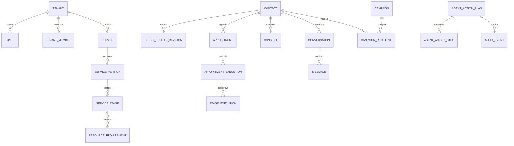
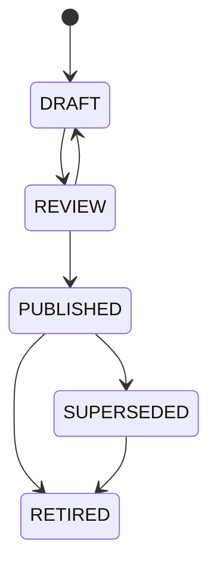
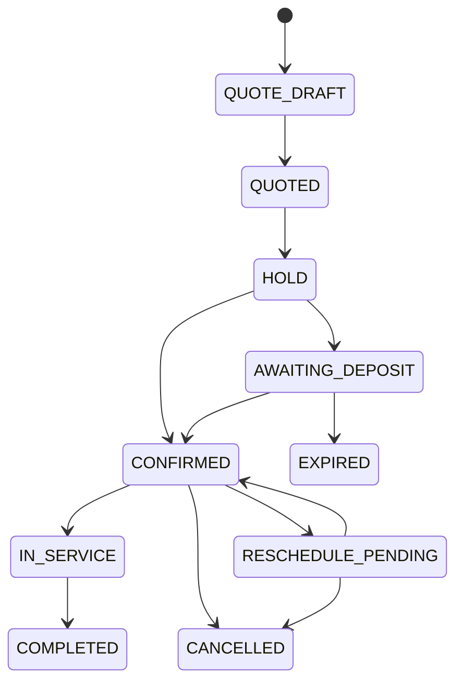
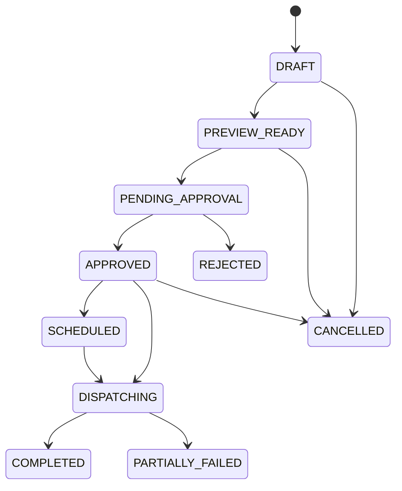

# Modelo de Domínio — SaaS de Agente de IA para Negócios de Beleza

**Status:** modelo lógico proposto; nenhuma nova tabela deste documento foi aplicada em produção.  
**Regra estrutural:** toda entidade de domínio pertence a um `tenant_id`; referências entre entidades multiempresa usam chaves compostas `(tenant_id, id)` ou validação equivalente no banco.

## 1. Mapa de agregados

## 2. Catálogo técnico e operação

| Entidade | Responsabilidade | Campos-chave |
|---|---|---|
| `service` | Identidade comercial do serviço vendável | `tenant_id`, `segment`, `name`, `status`, `current_version_id` |
| `service_version` | Snapshot publicável de preço, duração, política e descrição | `service_id`, `version`, `status`, `published_at`, `pricing_policy_id` |
| `service_stage` | Etapa ordenada de um serviço composto | `stage_type`, `sequence`, `entry_condition`, `duration_policy`, `blocking_mode` |
| `stage_resource_requirement` | Recurso necessário por etapa | `stage_id`, `resource_type`, `quantity`, `reservation_mode` |
| `service_variant_dimension` | Eixo de variação do tenant | `dimension` (comprimento, densidade etc.), `values`, `required_for_quote` |
| `service_pricing_rule` | Regra determinística de preço/duração | `conditions_json`, `price`, `duration_minutes`, `requires_review` |
| `technical_product` | Produto declarado no catálogo interno | marca, linha, regularidade declarada, instrução, validade, status |
| `service_prerequisite` | Teste, avaliação, sinal, autorização ou checagem exigida | tipo, janela de validade, severidade ao falhar, responsável |
| `professional_skill` | Aptidão aprovada do profissional | profissional, habilidade, escopo, validade, evidência |
| `resource` | Lavatório, cadeira, sala, equipamento ou kit | unidade, tipo, capacidade, disponibilidade |

Uma `service_version` é imutável após publicada. Edição cria uma nova versão; o agendamento guarda qual versão foi cotada e a execução guarda qual versão foi realizada. Isso evita que alterar preço ou protocolo hoje reescreva o histórico de ontem.

### 2.1 Estado do serviço e da ficha técnica

`PUBLISHED` exige validações: etapa inicial/final, duração coerente, responsável/habilidade, política de preço, recursos e pré-requisitos completos. Procedimento químico adiciona produto/instrução vinculados, confirmação do responsável e regras de segurança configuradas.

## 3. Cliente, perfil técnico, imagem e histórico realizado

| Entidade | Responsabilidade | Campos-chave |
|---|---|---|
| `crm_contact` | Pessoa identificada por canal | `tenant_id`, nome exibido, status, referência externa |
| `crm_contact_channel` | Identificador por provedor | contato, provedor, endereço normalizado, canal/telefone, verificação |
| `client_profile_revision` | Histórico de informação de perfil | contato, dados declarados/revisados, origem, autor, `supersedes_id` |
| `hair_profile_attribute` | Atributo configurável de cabelo | dimensão, valor, confiança, fonte, observação |
| `client_technical_record` | Registro técnico de procedimento realizado | execução, serviço/versão, profissional, observações, revisão necessária |
| `client_media_asset` | Foto/documento com finalidade limitada | consentimento, classificação, confiança, hash, retenção, referência de storage |
| `client_consideration` | Preferência, restrição declarada ou observação | categoria, valor, origem, expiração, visibilidade por papel |

O banco separa dado informado, dado inferido e dado revisado. Um atributo extraído de imagem pode auxiliar conversa, mas não sobrescreve atributo revisado pelo profissional nem serve de gatilho isolado para preço/serviço químico.

## 4. Agenda, cotação e execução

| Entidade | Responsabilidade | Campos-chave |
|---|---|---|
| `quote` | Proposta determinística, rastreável e expirável | contato, serviço/versão, variações, preço, duração, motivos, expiração |
| `appointment` | Compromisso de atendimento | contato, unidade, serviço/versão, estado, janela, política/sinal aplicados |
| `appointment_stage_reservation` | Reserva por etapa e recurso/pessoa | agendamento, etapa, início/fim, profissional, recurso, estado |
| `appointment_execution` | Evidência de atendimento realizado | agendamento, início/fim real, executor, estado, motivo de divergência |
| `stage_execution` | Evidência por etapa | execução, etapa, executada_em, duração real, responsável, observação |
| `payment_obligation` | Sinal ou cobrança governada | regra, valor, status, referência de provedor, vencimento |
| `availability_exception` | Exceção de agenda aprovada | escopo, período, tipo, justificativa, aprovador |

Somente `COMPLETED` cria ou atualiza `client_technical_record` e pode iniciar cálculo de retorno. `CANCELLED`, `EXPIRED` ou `NO_SHOW` preservam seu histórico mas não contam como procedimento realizado.

## 5. Conversas, consentimento e CRM

| Entidade | Responsabilidade | Campos-chave |
|---|---|---|
| `conversation` | Sessão de atendimento por canal | contato, canal, status, responsável, pausa, último evento |
| `message` | Mensagem normalizada e idempotente | direção, `provider_message_id`, tipo, conteúdo minimizado, status, ocorrida_em |
| `contact_consent` | Consentimento por finalidade e canal | contato, canal, `TRANSACTIONAL`/`MARKETING`, estado, evidência, captura/revogação |
| `contact_preference` | Frequência, idioma, opt-out e preferências | contato, finalidade, valor, origem, alterada_em |
| `client_event` | Linha do tempo unificada | tipo, origem, contato, payload minimizado, ocorrida_em, correlação |
| `return_rule` | Regra de janela comercial pós-execução | serviço/variação, início, fim/tolerância, oferta, elegibilidade |
| `return_eligibility` | Resultado materializado explicável | contato, regra, execução de origem, estado, motivos, calculada_em |

Uma campanha de retorno não lê “o último procedimento” como texto solto. Ela usa `return_eligibility`, que liga a cliente a uma execução, versão de regra e razões determinísticas de inclusão/exclusão.

## 6. Promoções, campanhas e outbox

| Entidade | Responsabilidade | Campos-chave |
|---|---|---|
| `promotion` | Oferta de negócio aplicável a venda ou campanha | vigência, benefício, serviços, condições, estado |
| `message_template` | Template sincronizado do provedor | WABA/canal, nome, idioma, categoria, status/qualidade, conteúdo permitido |
| `campaign` | Intenção aprovada de comunicação | finalidade, segmento, template, promoção, estado, aprovada_por |
| `campaign_snapshot` | Público congelado e explicável | campanha, hash de filtro, contagem, criada_em, versão de regra |
| `campaign_recipient` | Um destinatário por snapshot | contato/canal, consentimento, razão, estado, idempotency_key |
| `outbox_message` | Tentativa externa rastreável | destinatário, template, payload mínimo, tentativa, provider_id, estado |
| `campaign_frequency_ledger` | Limites de contato por pessoa | contato, finalidade, período, quantidade, última mensagem |

O worker cria `outbox_message` somente para `APPROVED`/`SCHEDULED`, após revalidar consentimento, opt-out, template, frequência e canal. Mudanças de consentimento entre snapshot e envio tornam o destinatário `SKIPPED`, sem “forçar” o disparo.

## 7. Agentes, ferramentas e auditoria

| Entidade | Responsabilidade | Campos-chave |
|---|---|---|
| `agent_session` | Contexto curto de uma conversa com agente | ator, canal, contato/usuário, tenant, expiração, resumo autorizado |
| `agent_tool_invocation` | Chamada estruturada a ferramenta | ferramenta, entrada validada, saída resumida, status, correlação |
| `agent_action_plan` | Proposta explícita de ação operacional | intenção, impacto, estado, solicitante, expiração |
| `agent_action_step` | Efeito individual do plano | tipo, alvo, pré-condição, prévia, estado, resultado |
| `approval` | Consentimento do responsável para um plano/campanha | escopo, ator, decisão, versão visualizada, registrada_em |
| `audit_event` | Evento imutável de domínio e segurança | ator, entidade, evento, antes/depois mínimo, correlação, IP/metadados permitidos |

Nenhuma ferramenta recebe SQL livre, token ou acesso global. Cada ferramenta exige schema, tenant da sessão, política de papel, limites e idempotency key. A confirmação referencia uma versão do plano; editar destinatários ou mensagem invalida aprovação anterior.

## 8. Invariantes de banco

1. Não existe FK de domínio multiempresa que não valide o mesmo `tenant_id`.
2. `provider_message_id`, `webhook_event_id`, `calendar_event_id`, `payment_event_id` e `idempotency_key` possuem unicidade no escopo correto.
3. Dados de consentimento jamais são atualizados sem preservar evidência e histórico de revogação.
4. `message`, mídia e observação não são usados para campanha sem base de finalidade e canal compatível.
5. Uma ação externa só sai de `PENDING_APPROVAL` se houver aprovação válida da versão exata do plano.
6. Atualizações de perfil técnico não apagam a informação anterior sem regra de retenção; revisões preservam proveniência.
